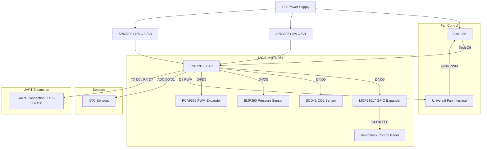

# 🌬️ VentoSync — ESPHome Smart HRV Control for VentoMaxx V-WRG

[](Readme_de.md)

## ⚖️ Disclaimer

> ⚠️ **VentoSync is an independent community project and NOT affiliated with Ventomaxx GmbH.**

## 🚀 Summary & Overview

This open-source project offers a professional, decentralized heat recovery ventilation (HRV) control system based on ESPHome. It replaces the control system of the VentoMaxx V-WRG series using a custom developed printed circuit board (PCB) based on an ESP32-C6 microcontroller, controlling the reversible 12V fan for heat recovery.
It optionally monitors air quality (CO2, humidity, and temperature) using a high-quality Sensirion SCD41 sensor, calculates effective heat recovery and uses the **original VentoMaxx control panel** for seamless integration and intuitive operation.
Furthermore, a mmWave radar sensor for presence detection can be optionally integrated and mounted invisibly behind the front cover of the ventilation unit.
Communication between individual ventilation units takes place via the stable ESP-NOW protocol, so no Wi-Fi or power line communication is required.

> 💡 **Compatibility:** The control system works in principle for any decentralized residential ventilation which works with a reversible 12V fan (3-PIN or 4-PIN PWM). However, it was **specifically developed as a replacement for the VentoMaxx V-WRG series**. The hardware (PCB layout/size and control panel) is therefore explicitly optimized for the VentoMaxx V-WRG series and needs to be adapted for other manufacturers. The PCB is designed to fit exactly into the housing of the VentoMaxx V-WRG series and uses the existing mounting points.
Attention: This solution is not compatible with the VentoMaxx ZR-WRG series, as it uses a central control unit! Adaption to the ZR-WRG series is possible, but currently not implemented.

[](https://github.com/thomasengeroff-dotcom/VentoSync/actions/workflows/build.yaml)
[](https://github.com/thomasengeroff-dotcom/VentoSync/releases)
[](https://esphome.io/)
[](https://www.home-assistant.io/)
[](https://esphome.io/components/esp32.html)


---

## 📑 Table of Contents

- [⚖️ Disclaimer](#⚖️-disclaimer)
- [🚀 Summary & Overview](#🚀-summary--overview)
  - [Motivation](#motivation)
  - [🛠️ Custom made PCB](#🛠️-custom-made-pcb)
  - [🔄 Comparison with VentoMaxx V-WRG](#🔄-comparison-with-ventomaxx-v-wrg)
- [✨ Features](#✨-features)
  - [⚙️ Intelligent Operating Modes](#⚙️-intelligent-operating-modes)
  - [🛡️ Precision Sensors & Monitoring](#🛡️-precision-sensors--monitoring)
  - [Additional Features](#additional-features)
  - [⚡ Extremely Low Power Consumption](#⚡-extremely-low-power-consumption)
  - [🖥️ Operation at the Ventilation Device](#🖥️-operation-at-the-ventilation-device)
  - [🏠 Home Assistant Integration](#🏠-home-assistant-integration)
  - [📊 VentoSync Dashboard - Local Web Dashboard](#📊-ventosync-dashboard---local-web-dashboard)
- [📡 ESP-NOW: Wireless Autonomy](#📡-esp-now-wireless-autonomy)
  - [Advantages at a Glance](#advantages-at-a-glance)
  - [Discovery Process](#discovery-process)
- [🗺️ Roadmap & Future Enhancements](#🗺️-roadmap--future-enhancements)
- [🎛️ Custom Circuit Board - PCB](#️-custom-circuit-board---pcb)
  - [Specialized SCD41 Sensor Board](#specialized-scd41-sensor-board)
- [🛠️ Hardware & Bill of Materials (BOM)](#🛠️-hardware--bill-of-materials-bom)
  - [Central Unit](#central-unit)
  - [Actuators & Sensors](#actuators--sensors)
  - [🖱️ On-Device Control Panel](#🖱️-on-device-control-panel)
- [🔌 Pin Assignment & Wiring](#🔌-pin-assignment--wiring)
  - [📊 Schematic Representation (Concept)](#📊-schematic-representation-concept)
- [🛠️ Setup & Installation](#🛠️-setup--installation)
  - [1. Development Environment (Linux venv & ESPHome CLI)](#1-development-environment-linux-venv--esphome-cli)
  - [2. Configuration & Compilation](#2-configuration--compilation)
  - [3. Initial Flashing & Provisioning](#3-initial-flashing--provisioning)
  - [4. OTA Updates & Home Assistant Integration](#4-ota-updates--home-assistant-integration)
  - [Calibration of NTCs](#calibration-of-ntcs)
- [🎮 Operation & Control](#🎮-operation--control)
  - [🖥️ Control Panel (VentoMaxx Style)](#🖥️-control-panel-ventomaxx-style)
  - [🔄 Operating Modes (Programs)](#🔄-operating-modes-programs)
  - [📱 Control via Home Assistant](#📱-control-via-home-assistant)
- [🧠 Heat Recovery - How it works](#🧠-heat-recovery---how-it-works)
  - [Fundamental Principle](#fundamental-principle)
  - [Operating Cycle (50s to 70s per phase)](#operating-cycle-50s-to-70s-per-phase)
  - [Phase 1: Exhaust Air (Blowing Out) - 70 Seconds](#phase-1-exhaust-air-blowing-out---70-seconds)
  - [Phase 2: Supply Air (Blowing In) - 70 Seconds](#phase-2-supply-air-blowing-in---70-seconds)
  - [NTC Sensors (Temperature Stabilization)](#ntc-sensors-temperature-stabilization)
  - [Air Quality & Gas Sensors (BME680)](#air-quality--gas-sensors-bme680)
  - [Efficiency Calculation (Energy-Based)](#efficiency-calculation-energy-based)
  - [Optimizing Efficiency](#optimizing-efficiency)
  - [Synchronization of Multiple Devices](#synchronization-of-multiple-devices)
- [🔧 Technical Details & Optimizations](#🔧-technical-details--optimizations)
- [📁 Project Structure](#📁-project-structure)
- [🏗️ Code Architecture & Maintainability](#🏗️-code-architecture--maintainability)
- [🚀 Automated Release & Versioning](#🚀-automated-release--versioning)
- [⚠️ Safety Instructions](#⚠️-safety-instructions)
- [Keywords](#keywords)
- [⚖️ Legal Disclaimer](#⚖️-legal-disclaimer)
- [📜 License](#📜-license)

---

## Motivation

Many years ago, as part of a house renovation, I installed the V-WRG decentralized residential ventilation from Ventomaxx (10 units) and was very satisfied with it. However, the proprietary control and the lack of integration into my smart home system always bothered me. Therefore, I decided to develop my own circuit board (PCB) including control software based on ESPHome, as there was no ready-made solution. This solution is open source and is intended to help other users who are in the same situation as I was.
For ventilation control based on CO2, I use an extremely high-quality and precise CO2 sensor (Sensirion SCD41), which is integrated directly into the board (via a small additional PCB; Note: Currently the Bosch BME680 serves as a fallback, as the SCD41 PCB is still in production). This sensor measures the real CO2 concentration in the air and controls the ventilation intensity according to the presets (using modern PID control). All code comments and internal documentation have been switched to English for better international maintainability, while the user interface remains in German (at least for now).
Since the ventilation units in the various rooms are usually in a very central position, I also use them directly for presence detection via a radar sensor, which can be mounted invisibly hidden behind the cover of the ventilation unit. The presence sensor is used for controlling the ventilation intensity in Smart automatic mode and can also be used in Home Assistant for any other automation.
According to my research, the range of functionality of this project goes beyond everything currently found on the ventilation unit market!
If you own a VentoMaxx V-WRG system, you are in luck: you can easily upgrade your system and boost it with advanced, 21st-century smart features!

---

## 🛠️ Custom made PCB

The heart of the project is a custom developed circuit board that fits perfectly into the existing housing of the VentoMaxx units.


> [!TIP]
> If you are interested in obtaining a PCB for your own devices, please feel free to contact me at **<thomas@engeroff.net>**.
> Please note that I have not yet decided whether the PCB production files will be made open source.


> [!CAUTION]
> **DANGER TO LIFE (230V Mains Voltage):** Working on and installing the PCB into the ventilation unit involves **230V mains voltage**. Installation and electrical connection **MUST only be performed by a qualified electrician** in accordance with applicable safety regulations!

---

## 🔄 Comparison with VentoMaxx V-WRG

This solution is a **drop-in replacement** for the [VentoMaxx V-WRG / WRG PLUS](https://www.ventomaxx.de/dezentrale-lueftung-produktuebersicht/aktive-luefter-mit-waermerueckgewinnung/) control — mechanically compatible, functionally massively expanded:

| | VentoMaxx (Original) | ESPHome Smart WRG |
| :--- | :---: | :---: |
| Operating Modes | 3 | **5+** (incl. smart automation) |
| Sensors | 0-1 (opt. VOC) | **6** (CO2, Temp, Humidity, Pressure, Radar, Tachometer) |
| Fan Control | 5 fixed levels | **10 levels (discrete PID)** |
| Smart Home | ❌ | ✅ Home Assistant (native) |
| Maintenance Alarm | Timer-LED | ✅ Predictive + Push |
| Synchronization | Power line | ✅ Wireless (**ESP-NOW Protocol**) & Real-time Sync |
| Updates | Service technician (must be sent in) | ✅ Over-the-Air (OTA) |
| Versioning | Manual | ✅ Fully automatic (Patch-Level) |
| Extendability | ❌ | ✅ System can be extended with additional sensors and actuators or individual functions |
| License | Proprietary | ✅ Open Source (GPL v3) |

 **You can find the full feature-for-feature comparison with all technical details in [📄 Comparison-VentoMaxx.md](documentation/Comparison-VentoMaxx.md).**

---

## ✨ Features

### ⚙️ Intelligent Operating Modes

All devices in a room find each other automatically upon startup or room change via **dynamic ESP-NOW discovery** and subsequently communicate efficiently via unicast.

- 🤖 **Smart automatic**: Fully automatic control for maximum comfort and efficiency. Standard operation in heat recovery (push-pull) with dynamic PID-based adjustment to CO2 and humidity, taking outdoor air conditions into account. In summer, cross-ventilation for passive nightly cooling is automatically activated when it is cooler outside than inside. *→ [Full details and timing examples in 📄 Operating-Modes.md](documentation/Operating-Modes.md)*
- 🔄 **Efficient Heat Recovery**: Cyclic, bidirectional operation (push-pull) to maximize energy efficiency. While automatic CO2 and humidity control are inactive in manual mode, presence detection can dynamically adjust fan intensity if enabled.
- 💨 **Cross-Ventilation (Summer Mode)**: Constant airflow without changing direction (Phase-A units blow in, Phase-B units blow out simultaneously to create an effective cross-draft for passive night cooling). Flexibly configurable via timer or as continuous operation.
- 🚀 **Boost Ventilation**: Intensive ventilation for quick air exchange. The device ventilates for 15 minutes with the **manually selected intensity** and then pauses for 105 minutes to effectively remove moisture and regenerate the ceramic heat exchanger. The cycle then repeats.
- 🌡️ **Off (Monitoring Mode)**: The fan is switched off (0 RPM) but all sensors (CO2, Temp, Radar) and the web dashboard remain fully active to ensure gap-less measurement data in Home Assistant. *(Note: Ultra-low-power Light Sleep with Wi-Fi turned off is available via long-press on the Power button >5s).*

### 🛡️ Precision Sensors & Monitoring

- 🌡️ **Climate Data Acquisition**: High-precision measurement of temperature and relative humidity using [Sensirion SCD41](https://sensirion.com/de/produkte/katalog/SCD41).
  - ✅ **Photoacoustic sensing** for precise CO2 measurement (400-5000 ppm), integrated temperature and humidity measurement (SCD41), Documentation: `EasyEDA-Pro/components/SCD41-Sensirion.pdf`
  - ✅ **BME680 Advanced IAQ Engine**: The BME680 now uses a custom C++ engine for robust baseline tracking, dynamic thermal compensation, and smart flash wear-leveling. This provides high-quality VOC/IAQ data without the overhead of the BSEC library.
  - ⚠️ **Note:** Since the SCD41 PCB is still in production, the **BME680** currently serves as a fallback (IAQ index). The code automatically detects if the SCD41 is present.
  - 🏔️ **Air Pressure Measurement & Hardware Protection via BMP390**: The high-precision barometer sensor [Bosch BMP390](https://www.bosch-sensortec.com/en/products/environmental-sensors/pressure-sensors/pressure-sensors-bmp390.html) not only provides local weather data and barometric compensation for the SCD41 but also acts as a **safety guard for the Traco power supply**:
    - **Automatic Derating Management**: Monitoring the internal temperature in the housing of the ventilation unit to comply with Traco specifications.
    - **Emergency Shutdown**: At critical temperatures (>60°C), a safety protocol starts (fan stop and 60min deep sleep) to protect the hardware from overheating and sends a corresponding warning to Home Assistant.

- **💨 Enthalpy-Balance / Absolute Humidity Guard**: Unlike conventional systems that compare relative humidity (which is misleading — cold air at 90% rH holds far less water than warm air at 50% rH), VentoSync calculates the **absolute humidity** in g/m³ using the [Magnus formula](https://en.wikipedia.org/wiki/Clausius%E2%80%93Clapeyron_relation). Humidity-driven ventilation is **only activated when outdoor air is actually drier** than indoor air. If outdoor air is more humid, the humidity demand is set to **zero** — the system will not import moisture, even if the humidity PID controller requests more ventilation.

    | Scenario | Indoor | Outdoor | Absolute Humidity | Result |
    | --- | --- | --- | --- | --- |
    | ☀️ **Normal summer day** | 23°C / 55% rH | 20°C / 45% rH | Indoor: 11.3 g/m³ **>** Outdoor: 7.8 g/m³ | ✅ Ventilation helps → humidity demand active |
    | 🌧️ **Rainy / muggy day** | 23°C / 55% rH | 18°C / 90% rH | Indoor: 11.3 g/m³ **<** Outdoor: 13.8 g/m³ | 🛑 Outdoor air more humid → humidity demand = 0 |
    | ❄️ **Winter night** | 21°C / 45% rH | −5°C / 80% rH | Indoor: 8.3 g/m³ **>** Outdoor: 2.6 g/m³ | ✅ Cold air is very dry → ventilation helps |

    > [!TIP]
    > This feature sets VentoSync apart from most commercial HRV units, which blindly ventilate based on relative humidity alone and can actually **increase** indoor moisture during rainy or muggy weather.

    If both temperature sensors are unavailable, the system falls back to a simple relative humidity comparison as a safety net. See [📄 Automatic-Mode-Logic.md](documentation/Automatic-Mode-Logic.md) for full technical details.

- 📊 **Optimized VentoMaxx Ventilation Curve**: Based on the physical parameters of the original hardware (50% PWM = stop zone), the curve has been optimized with finer granularity in the lower levels (Levels 1-6) to ensure even more discreet acoustic operation.
- 🪟 **Window Guard**: Automatic room-wide ventilation pause with 5s delay, auto-resume, visual Master LED feedback, and individual bypass switches.
  > 👉 *Setup guide & behavior details: [📄 Window Guard Setup Guide](documentation/Window-Guard-HA-Setup.md).*

- 🌟 **Advanced Comfort & Protection Features**:
  - 📈 **Phase Continuity & Soft Start**: Proportional cycle scaling during speed changes and smooth speed transitions (~5%/s) for minimal wear and quiet operation.
  - 🔄 **Real-Time Diagnostics**: Plain-text airflow direction (*Supply Air*, *Exhaust Air*, *Standstill*) and virtual speed calculation (4200 RPM @ 100%).
  - 🌴 **Vacation Mode**: Automated energy-saving mode with configurable presets during extended absences.
  - 🔒 **Child Protection Mode**: Locks physical panel buttons via Home Assistant or on-device combo (5s hold) with LED feedback.
  > 👉 *For complete details, entities & configuration, see [📄 Comfort & Safety Features](documentation/Comfort-and-Safety-Features.md).*  

### ⚡ Extremely Low Power Consumption

The VentoMaxx system with this ESPHome control works outstandingly efficiently. By using a high-quality Traco power supply and precision PWM control of the ebm-papst motor, the real power (measured at 230V) is in a range that is significantly lower than many commercial systems:

- **Level 1 (Base Ventilation):** ~2.7 - 2.9 Watts *(approx. €7.36 / year)*
- **Level 5 (Increased Load):** ~3.2 - 3.7 Watts *(approx. €9.10 / year)*
- **Level 10 (Maximum Power):** ~5.0 - 6.0 Watts *(approx. €15.75 / year)*

Even with 24/7 continuous operation at the *absolute maximum level (10)*, the nominal electricity costs (at €0.30/kWh) amount to only around 15 euros per year. In the most frequently used Smart automatic mode (values fluctuate between level 1 and 3 most of the time), the real operating costs are extremely economical at **approx. 7 to 8.50 euros per year** for the entire unit.

> **Note**: This is not a 100% accurate laboratory measurement. I determined these values using a Shelly 1PM mini.

*Particularly noteworthy: These measurements include the continuous operation of all installed components – including the ESP32 control (Wi-Fi/ESP-NOW), the climate and CO2 sensors, as well as the continuously measuring mmWave radar presence sensor!*

### 🖥️ Operation at the Ventilation Device

To ensure an optimal user experience, the original 9-LED / 3-button control panel of the VentoMaxx V-WRG-1 is fully retained and enhanced with 10 ventilation levels, real-time group wake-up synchronization, and intelligent LED diagnostic blink codes.


> 👉 *For complete button controls, 10-level LED fill bar logic, and diagnostic blink patterns, see [📄 Control Panel Operation Guide](documentation/Control-Panel-Operation.md).*

### 🏠 Home Assistant Integration

**Full Home Assistant Integration**: Native **ESPHome Native API** support for high-performance, real-time monitoring and control. Unlike traditional MQTT, the Native API uses highly optimized protocol buffers for minimal latency and footprint.

- **Instant Synchronization**: State changes are pushed instantly with up to 10x smaller message sizes than MQTT.
- **Zero-Configuration**: Automatic discovery in Home Assistant—no manual entity setup or MQTT broker required.
- **Enterprise-Grade Security**: Encrypted communication via Noise protocol using pre-shared keys.

**Hybrid Integration Philosophy**: While the **primary focus** of VentoSync is a deep and seamless integration into **Home Assistant**, the project also offers a powerful alternative. Through the built-in **Local Web Dashboard**, the system can be used as a **fully functional standalone solution**. This allows users to enjoy the complete range of features—from automated ventilation to sensor diagnostics—without ever needing to set up or maintain a Home Assistant instance.

### 📊 VentoSync Dashboard - Local Web Dashboard

You do not need a smart home server to use VentoSync: Each ventilation unit hosts its own built-in web page that you can open directly in any web browser on your smartphone, tablet, or PC — allowing you to monitor air quality live, change ventilation modes, and adjust settings without installing any apps or extra software.

<p align="center">
  
  &nbsp;
  
</p>

> 👉 *For full dashboard features, ESP-NOW live visualization, and the standard ESPHome interface, see [📄 Local Web Dashboard Guide](documentation/Local-Web-Dashboard.md).*

## 📡 ESP-NOW: Wireless Autonomy

VentoSync devices communicate directly with each other using [ESP-NOW](https://esphome.io/components/espnow.html) — a fast, connectionless 2.4 GHz radio protocol developed by Espressif.

I deliberately chose **not** to use powerline communication (PLC / data transmission over the 230V mains) as used in the original VentoMaxx systems: Powerline communication in residential environments is often prone to electrical noise and phase-coupling issues, while standard Wi-Fi depends heavily on external router availability. **ESP-NOW** represents the ideal, modern solution — an extremely reliable, ultra-fast, and direct device-to-device radio link that operates completely independently of your home Wi-Fi network and requires zero physical control cables.

<p align="center">
  
</p>

> 👉 *For complete protocol details (v4 packets), dynamic room discovery, unicast architecture, and antenna optimization, see [📄 ESP-NOW Communication Guide](documentation/ESP-NOW-Communication.md).*

---

## 🗺️ Roadmap & Future Enhancements

VentoSync is actively maintained and continuously evolving with a focus on deeper sensor fusion, acoustic optimization, and next-generation smart automations.

> 👉 *For complete descriptions and concepts of upcoming features and roadmap milestones, see [📄 Roadmap & Future Enhancements](documentation/Roadmap-and-Future-Enhancements.md).*

## 🎛️ Custom Circuit Board - PCB

A custom-engineered PCB has been developed to integrate all core components (XIAO ESP32-C6, Traco Power DC/DC converters, logic-level shifters) into a compact, robust unit. The boards are manufactured by JLCPCB and are currently in the final validation phase.

**Key Design Principles:**

- **Industrial-Grade Reliability**: Components were selected for a projected service life of >10 years under 24/7 continuous operation.
- **Safety First**: Despite the low power consumption, the layout follows strict safety standards to ensure fire safety and voltage stability.
- **Future-Proof Expansion**: The board includes dedicated expansion headers for future upgrades:
  - **H4 (UART)**: High-speed serial connection (currently utilized for the mmWave Radar).
  - **H3 (I²C)**: For additional environmental sensors or OLED displays.
  - **H1 (GPIO)**: 6 free GPIOs including 3.3V/GND for custom DIY expansions.


### Specialized SCD41 Sensor Board

To achieve the highest possible accuracy, I developed a secondary PCB specifically for the **Sensirion SCD41**. Unlike generic breakout boards, this design implements the manufacturer's reference specifications for decoupling:

- **Thermal Isolation**: A specialized milling slot and copper-free zones "thermally decouple" the sensor from the PCB's heat mass.
- **Precision Filtering**: Proper decoupling capacitors are placed in immediate proximity to the sensor.
- **Perfect Fit**: Designed with a 1.25mm pitch connector to align perfectly with the VentoMaxx housing's ventilation intake (connector H2).


---

## 🛠️ Hardware & Bill of Materials (BOM)

### Central Unit

| Component | Description |
| :--- | :--- |
| **MCU** | [Seeed Studio XIAO ESP32C6](https://wiki.seeedstudio.com/xiao_esp32c6_getting_started/) (RISC-V, WiFi 6, Zigbee/Matter ready) |
| **Power** | TRACO POWER TMPS 10-112 (230VAC to 12VDC, 10W) <br>– **Premium Choice:** Certified according to **EN 60335-1** (household appliances) and **EN 62368-1** (IT/industry). The choice fell on this high-end module from Traco Power (Switzerland) because it offers maximum safety through its double insulation (**protection class II**) and high insulation voltage (4kV). Unlike inexpensive power supplies, it meets the strict EMC requirements of **Class B** without external filters and is designed for maintenance-free continuous operation (>10 years) in residential spaces. |
| **DC/DC** | Diodes Inc. AP63205 (12V->5V) & AP63203 (12V->3.3V) <br>– **Custom Development:** These two professional step-down converters (Buck Converters) were implemented directly on the PCB for high-efficiency energy conversion (up to 94% efficiency). They ensure an extremely stable power supply for MCU and sensors with minimal heat generation – a key factor for the long-term stability of the system in continuous operation. |

### Actuators & Sensors

| Component | Description | Documentation |
| :--- | :--- | :--- |
| **Fan** | The original VentoMaxx V-WRG units use the **EBM-PAPST 4412 F/2 GLL (VarioPro)** **3-Pin PWM** (without tachometer signal) fan. Alternatively, a much more modern and quieter **AxiRev** (4-Pin PWM) can be used. For this, however, you would have to handle the mounting via a 3D-printed adapter. *Wiring shown below.* | [Fan Component](https://esphome.io/components/fan/speed.html) |
| **SCD41** | Sensirion CO2 sensor (Real CO2 400-5000ppm, Temp, Hum) via I²C | [SCD4X Component](https://esphome.io/components/sensor/scd4x.html) |
| **BMP390** | Bosch high-precision barometric pressure sensor via I²C | [BMP3XX Component](https://esphome.io/components/sensor/bmp3xx.html) |
| **BME680** | Bosch gas sensor (fallback for IAQ/air quality) via I²C | [BME680 Component](https://esphome.io/components/sensor/bme680.html) |
| **NTCs** | 2x NTC 10k (Supply Air/Exhaust Air) for efficiency measurement | [NTC Sensor](https://esphome.io/components/sensor/NTC.html) |
| **I/O Expander** | **MCP23017** (I2C) for VentoMaxx panel | [MCP23017](https://esphome.io/components/mcp23017.html) |
| **LED Driver** | **PCA9685** (I2C) for dimmable LEDs in VentoMaxx panel | [PCA9685](https://esphome.io/components/output/pca9685.html) |


*Fan connector wiring, with original cable.*

The complete Bill of Materials (BOM) is located in the [EasyEDA-Pro](EasyEDA-Pro/) subfolder in the [BOM](EasyEDA-Pro/BOM_VentoSync_PWM_PCB_VentoSync-WRG_ESP32_PWM_2026-03-01.csv).

### 🖱️ On-Device Control Panel

| Component | Description | Documentation |
| :--- | :--- | :--- |
| **VentoMaxx Panel** | Original panel (14-Pin FFC). 3 buttons, 9 LEDs (dimmable via PCA9685). | The pinout of the original panel was completely measured and documented by me to enable exact control via the custom PCB and the port expanders (MCP23017/PCA9685). |


---

## 🔌 Pin Assignment & Wiring

The system is based on the [Seeed XIAO ESP32C6](https://wiki.seeedstudio.com/xiao_esp32c6_getting_started/).

⚠️ **IMPORTANT:** The fan runs on 12V, the logic on 3.3V or 5V (radar sensor). Corresponding voltage dividers and protection circuits are present.

| XIAO Pin | GPIO | Function | Remark |
| :--- | :--- | :--- | :--- |
| **D0** | GPIO0 | [ADC Input](https://esphome.io/components/sensor/adc.html) | NTC Outside (Exhaust Air) |
| **D1** | GPIO1 | [ADC Input](https://esphome.io/components/sensor/adc.html) | NTC Inside (Supply Air) |
| **D2** | GPIO2 | Output | **MCP23017 Reset** |
| **D3** | GPIO21 | Output | **PCA9685 OE** (Output Enable) |
| **D4** | GPIO22 | [I2C SDA](https://esphome.io/components/i2c.html) | SCD41, BMP390, PCA9685, MCP23017 |
| **D5** | GPIO23 | [I2C SCL](https://esphome.io/components/i2c.html) | SCD41, BMP390, PCA9685, MCP23017 |
| **D6** | GPIO16 | [UART RX](https://esphome.io/components/uart.html) | **HLK-LD2450 Radar RX** |
| **D7** | GPIO17 | [UART TX](https://esphome.io/components/uart.html) | **HLK-LD2450 Radar TX** |
| **D8** | GPIO19 | [PWM Output](https://esphome.io/components/output/ledc.html) | **Fan PWM Primary** |
| **D9** | GPIO20 | [Pulse Counter](https://esphome.io/components/sensor/pulse_counter.html) | **Fan Tach** (Pullup via 3V3) |
| **D10** | GPIO18 | - | Not connected (NC) |

### 📊 Schematic Representation (Concept)



---

## 🛠️ Setup & Installation

### 1. Development Environment (Linux `venv` & ESPHome CLI)

For a stable development environment, it is strongly recommended to install ESPHome within a **Python virtual environment** (`venv`). This avoids conflicts with system-wide packages and is the only officially supported manual installation method on Linux.

```bash
# 1. Create a virtual environment
python3 -m venv venv

# 2. Activate the environment
source venv/bin/activate

# 3. Install ESPHome
pip install --upgrade esphome
```

*(Note: Always remember to run `source venv/bin/activate` before using the `esphome` command in a new terminal session.)*

#### 🔄 Updating the Environment

To keep your development environment up to date, use the following commands:

**Update ESPHome (inside venv):**

```bash
# Ensure venv is active
source venv/bin/activate
# Update to latest version
pip install --upgrade esphome
```

**Full System & Python Update (Linux):**

```bash
# Update package list and upgrade all system packages
sudo apt update && sudo apt upgrade -y
```

**Update pip & setuptools (inside venv):**

```bash
pip install --upgrade pip setuptools
```

### 2. Configuration & Compilation

VentoSync now uses a modular hardware architecture. Depending on your hardware setup, select the appropriate configuration file:

- **`ventosync.yaml`**: Full version (SCD41, BME680, LD2450)
- **`ventosync_bme680_only.yaml`**: Fallback/Test version (BME680, no SCD41, no LD2450)
- **`ventosync_radar_only.yaml`**: Devices with mmWave presence detection but no climate sensors
- **`ventosync_nosensor.yaml`**: Basic ventilation control without environmental sensors

Use the provided `upload_all.sh` script to automatically compile and upload the correct variant to all your devices locally:

```bash
# Upload to all devices defined in the script
./upload_all.sh
```

Or manually for a single device using the ESPHome CLI:

```bash
# 1. Validate configuration (checks for YAML errors)
esphome config ventosync_nosensor.yaml

# 2. Compile & Upload via OTA (automatically uploads to the specified IP)
esphome run ventosync_nosensor.yaml --device <IP-Address> --no-logs

# 3. Only compile (generates the binary without uploading)
esphome compile ventosync_nosensor.yaml

# 4. Only upload (useful if you already compiled the binary)
esphome upload ventosync_nosensor.yaml --device <IP-Address> --no-logs
```

### 3. Initial Flashing & Provisioning

1. **Prepare Firmware**: Compile the firmware with your own Wi-Fi settings (using `secrets.yaml`).
2. **Initial Flash**: Flash the ESP32-C6 (XIAO) initially via USB with the VentoSync firmware using the ESPHome dashboard or ESPHome CLI command:

   ```bash
   esphome run ventosync.yaml --device /dev/ttyACM0
   ```

3. **Hardware Installation**:
   > [!CAUTION]
   > **DANGER TO LIFE:** The installation of the PCB and ESP into the VentoMaxx ventilation unit involves working with **230V mains voltage**. This step **MUST only be performed by a qualified electrician**.
   Mount the PCB and ESP into the ventilation unit housing according to the wiring diagram as a drop-in replacement.
4. **Initial Provisioning (Captive Portal)**:
   VentoSync firmware binary releases on GitHub are "secret-free" and do not contain any hardcoded Wi-Fi credentials. When performing an OTA update using these official release binaries, or if your device loses its Wi-Fi connection, follow these steps to restore connectivity:
   1. Search for the Wi-Fi network **"VentoSync Hotspot"** on your smartphone or PC.
   2. Connect to it using the password: `ventosync`
   3. A Captive Portal window should automatically open (if not, browse to `192.168.4.1`).
   4. Select your home Wi-Fi network from the list and enter your password.
   **Done!** ESPHome has now permanently saved your credentials to the ESP32's internal non-volatile storage (NVS). **All future OTA updates will automatically use these stored credentials and connect seamlessly.**
5. **Network Configuration**: Locate the device in your router and assign a **static IP address** to ensure reliable communication.

### 4. OTA Updates & Home Assistant Integration

1. **Home Assistant Integration**: Add the device to Home Assistant under the ESPHome integration (it should be automatically discovered immediately).
2. **Configure Device Settings**: Once integrated, adjust the following parameters in the Home Assistant UI or the local Dashboard:
   - **Device ID** (Unique number for this device)
   - **Room ID** (Devices with the same Room ID will synchronize)
   - **Floor ID**
3. **Alternative - Web Dashboard**: If you don't use Home Assistant, you can configure all settings via the local web dashboard at `http://<device-ip>` and `http://<device-ip>/ui`.
4. **Enjoy**: Sit back and enjoy your smart HRV system!
5. **OTA Updates**:
   Example of Update process in Home Assistant:
   

### Calibration of NTCs

The configuration is optimized for the **[ENTC-10K9777-02](https://www.reichelt.de/de/de/shop/produkt/thermistor_ntc_-40_bis_125_c-350474)** NTC thermistor (10kΩ, B-value 3435). If you use other sensors, you must adapt the `b_constant` and `reference_resistance` values in the YAML code accordingly.

---

## 🎮 Operation & Control

The system is controlled intuitively via the integrated control panel or fully automatically via Home Assistant.

### 🖥️ On-Device Control Panel (VentoMaxx Style)

The unit features an intuitive 3-button control panel with 9 status LEDs (dimmable, with auto-dimming after 60 seconds of inactivity and diagnostic blink codes).

* **Power (I/O)**: Short press toggles ventilation ON/OFF; long press (>5s) enters Light Sleep; very long press (>10s) triggers reboot.
* **Mode (M)**: Cycles through `Auto` → `Heat Recovery` → `Ventilation` → `Boost Ventilation` → `Off`.
* **Level (+)**: Cycles through 10 fan speed levels (press) or continuous level cycling (hold).
* **Feedback**: Visualized via 5 Intensity LEDs (fill-bar with 50%/100% brightness steps), 2 Mode LEDs (`LED_WRG` / `LED_VEN`), Power LED, and Master diagnostic LED.

> 📖 **Complete Control Panel Guide:**  
> For full details on button operations, the 10-level LED fill-bar logic, diagnostic blink patterns (Master LED), and group wake-up behavior, see the **[📄 Control Panel Operation Guide](documentation/Control-Panel-Operation.md)**.

---

### 🔄 Operating Modes (Programs)

The ventilation system supports 5 operating modes, which can be selected via the physical **Mode button (M)** on the unit, the local web interface, or Home Assistant.

> **Button Sequence:** **Auto → Heat Recovery → Ventilation → Boost Ventilation → Off → Auto...** *(Upon initial power-on, **Mode 1 (Smart Automatic)** is active).*

| # | Mode | Panel LEDs (`WRG` / `VEN`) | Operation & Core Function | HA Entity / Selection |
| :-: | :--- | :---: | :--- | :--- |
| **1** | **🤖 Smart Automatic** *(Default)* | 🟢 *(pulses)* / ⚫ | Fully autonomous PID control based on CO2, humidity, and outdoor air conditions | `select.modus_lueftungsanlage` → `Smart automatic` |
| **2** | **❄️ Heat Recovery** *(Eco)* | 🟢 / ⚫ | Manual push-pull heat recovery (50s–70s cycle) with up to 85% heat preservation | `select.modus_lueftungsanlage` → `Eco Recovery` |
| **3** | **💨 Boost Ventilation** | ⚫ / 🟢 | Intensive 15 min rapid air renewal followed by a 105 min core regeneration pause | `button.stosslueftung_starten` / `Boost Ventilation` |
| **4** | **🌬️ Cross-Ventilation** *(Summer)* | 🟢 / 🟢 | Continuous unidirectional draft (Phase A in, Phase B out) for passive night cooling | `select.modus_lueftungsanlage` → `Ventilation` |
| **5** | **⭕ Off** *(Monitoring)* | ⚫ / ⚫ | Fan stopped (0 RPM); all climate sensors & web UI remain online for data logging | `select.modus_lueftungsanlage` → `Off` |

> 📖 **Comprehensive Operating Modes Guide:**  
> For full technical details on the PID control logic, real-world timing examples, enthalpy-based dehumidification, summer cooling hysteresis, and Light Sleep power saving, see the **[📄 Operating Modes & Logic Guide](documentation/Operating-Modes.md)**.

---

### 📱 Control via Home Assistant

All functions are fully integrated into Home Assistant. Changes on the panel are synchronized immediately.

#### Available Controls

- **Fan**: Slider 0-10% to 100% (internally corresponds to the 10 levels of the control panel)
- **Mode**: Selection (Smart automatic / Eco Recovery / Boost Ventilation / Ventilation / Off)
- **Timer**: Configuration for "Ventilation" (default: 30 min)
- **LED Brightness**: `number.max_led_brightness` (0-100%, default: 80%) to limit the maximum panel brightness.
- **CO2 Limit**: `number.auto_CO2_threshold` (always active in Automatik mode)
- **Diagnostics**: Display of RPM, temperature, humidity, and **CO2 content (ppm)**
- **Vacation Mode** *(Configuration)*:
  - `select.urlaubsmodus_betriebsmodus` — Operating mode when vacation is active (default: `Stoßlüftung`)
  - `number.urlaubsmodus_intensitat` — Fan intensity when vacation is active, 1–10 (default: `1`)

👉 **Tip:** A detailed overview of all available Home Assistant entities, including their technical names (`ID`) and functions, can be found in the document **[Entities_Documentation.md](documentation/Entities_Documentation.md)**.

#### 📊 Fan Speed per Level (VentoMaxx V-Curve)

The original VentoMaxx fan (**ebm-papst 4412 F/2 GLL**) is controlled via a **single PWM signal**. The characteristic curve follows a V-shape (measured via oscilloscope), with 50% PWM marking the standstill:

| | **50 % PWM** | **30 % → 5 % PWM** | **70 % → 95 % PWM** |
| --- | --- | --- | --- |
| **Function** | Fan **STOP** | Direction A (Exhaust / Out) | Direction B (Supply / In) |
| **Speed** | 0 RPM | increases with distance from 50% | increases with distance from 50% |

| Level | Performance | PWM Dir A (Exhaust) | PWM Dir B (Supply) | RPM (approx.) |
| :---: | :---: | :---: | :---: | :---: |
| **OFF** | 0 % | 50.0 % | 50.0 % | 0 |
| **1** | 10 % | 30.0 % | 70.0 % | 420 |
| **2** | 16 % | 27.2 % | 72.8 % | 672 |
| **3** | 23 % | 24.4 % | 75.6 % | 966 |
| **4** | 31 % | 21.7 % | 78.3 % | 1302 |
| **5** | 40 % | 18.9 % | 81.1 % | 1680 |
| **6** | 50 % | 16.1 % | 83.9 % | 2100 |
| **7** | 61 % | 13.3 % | 86.7 % | 2562 |
| **8** | 73 % | 10.6 % | 89.4 % | 3066 |
| **9** | 86 % | 7.8 % | 92.2 % | 3612 |
| **10** | 100 % | 5.0 % | 95.0 % | 4200 |

The RPM range is optimized to allow for finer steps at low levels (Levels 1-6) for even quieter operation, while the power increases more rapidly at higher levels.

> ⚙️ **Minimum Speed:** Level 1 corresponds to 10% speed (PWM at 50% = stop). In Smart automatic mode (PID), the speed is regulated in discrete steps (Levels 1-10) between `automatik_min_luefterstufe` and `automatik_max_luefterstufe`.
> 🔄 **Software Fan Ramping:** With every change of direction (Heat Recovery/Boost Ventilation), the system performs a **5-second gentle braking and soft-start ramp**. This protects the motor and minimizes switching noise. The intensity LEDs show the target value in the meantime.

#### Automatic Functions

- **Stealth Mode**: The LEDs are automatically switched off if the device is not operated.
- **Filter Change Alarm**: Predictive maintenance notification (see below).

#### 🧹 Setting up Filter Change Alarm in Home Assistant

The system automatically tracks the operating hours of the fan and triggers an alarm when:

- **Operating Hours > 365 days** (8760h runtime), or
- **Calendar Time > 3 years** since the last filter change.

**Available Entities:**

| Entity | Type | Description |
| --- | --- | --- |
| `binary_sensor.filterwechsel_alarm` | Binary Sensor | `ON` = filter change recommended |
| `sensor.filter_betriebstage` | Sensor | Fan runtime in days since last change |
| `button.filter_gewechselt_reset` | Button | Press after filter change → resets counter |

**Example: Push notification via HA Automation**

Add the following automation to your Home Assistant `automations.yaml`:

```yaml
automation:
  - alias: "Filter Change Notification"
    trigger:
      - platform: state
        entity_id: binary_sensor.ventosync_filterwechsel_alarm
        to: "on"
    action:
      - service: notify.mobile_app_<your_device>
        data:
          title: "🧹 Filter change recommended"
          message: >-
            The ventilation system has reached {{ states("sensor.esptest_filter_betriebstage") }} operating days
            since the last filter change. Please check and change filter.
          data:
            tag: "filter_change"
            importance: high
```

> 💡 **After the filter change:** Press the button `Filter changed (Reset)` in Home Assistant to reset the operating hours and the calendar timer.

---

## 🧠 Heat Recovery - How it works

### Fundamental Principle

The system uses a **ceramic regenerator** for heat recovery. This stores heat from the exhaust air and gives it to the supply air. The cycle time (phase) varies according to the air level between **50s and 70s** to optimize energy efficiency.

### Operating Cycle (50s to 70s per phase)


### Phase 1: Exhaust Air (Blowing Out) - 70 Seconds

```text
Interior (warm) → Ceramic heat exchanger → Exterior
    21°C              ↓ Store          5°C
                    heat
```

**What happens:**

- 🔥 Warm room air (21°C) flows through the ceramic heat exchanger
- 📈 Ceramic heats up and stores energy
- 🌡️ **Indoor NTC** measures the true room temperature at the end
- 💨 Cooled air (~10°C) is blown to the outside

### Phase 2: Supply Air (Blowing In) - 70 Seconds

```text
Exterior → Ceramic heat exchanger → Interior (pre-heated)
 5°C     ↑ Give off         ~16°C
        heat
```

**What happens:**

- ❄️ Cold outside air (5°C) flows through the warm ceramic heat exchanger
- 🔄 Ceramic gives off stored heat
- 🌡️ **Outdoor NTC** measures outside temperature
- 🌡️ **Indoor NTC** measures pre-heated supply air (~16°C)
- 🏠 Pre-heated air flows into the room

### NTC Sensors (Temperature Stabilization)

The NTC sensors measure the temperature at the ceramic heat exchanger inside and outside (`temp_zuluft` and `temp_abluft`). Since the fan direction in heat recovery mode changes cyclically (e.g., every 70 seconds), the sensors require a certain amount of time due to their thermal mass to adapt to the new air temperature. To make the measurement as accurate as possible, very small NTC sensors are used with the lowest possible mass and high accuracy. This makes the adaptation to the changing temperature, depending on the ventilation direction, as fast and precise as possible.
To avoid incorrect intermediate values in Home Assistant and to accurately capture the true thermal limits, both sensors use **intelligent, unified, and phase-aware temperature stabilization**:

- **Phase-Lock:** The system explicitly discards measurement values during the "wrong" airflow direction (e.g., indoor sensor during supply phase). This prevents the sliding window from being contaminated with recovered heat instead of true room air.
- **Thermal Wait:** After each change of direction (Push/Pull), measurement value transmission is paused for **40% of the cycle duration (min. 15s)** to allow the NTC to adapt to the new air stream.
- **Combined Filter Logic:** All stages (Phase-Lock, History Invalidation, Stability Check, and Seasonal Selection) are merged into a single, high-performance C++ function (`filter_ntc_combined`).
- **Dynamic Seasonal Selection:**
  - **Winter/Transition:** The outdoor sensor takes the minimum value (true cold outside air), and the indoor sensor takes the maximum value (true warm room air).
  - **Summer Cooling:** When outside air is hotter than inside air, the logic automatically reverses (outdoor takes max, indoor takes min).
- **Median Fallback:** If the reference sensor is temporarily unavailable, the system uses the median of the last 3 values as a safe compromise.
- **120s Failsafe Timeout:** A generous watchdog ensures the sensors stay "online" in Home Assistant even during long phases where values are legitimately blocked by the Phase-Lock.

*Note on redundancy:* `temp_zuluft` (Outdoor NTC) provides the actual outside temperature when the airflow is directed inward. `temp_abluft` (Indoor NTC) provides the room temperature when the airflow is directed outward and serves as redundancy for the more precise SCD41 sensor.

Specifically, the following sensor is used:

| Manufacturer | Part Number | Source | Accuracy | Data Sheet |
| :--- | :--- | :--- | :--- | :--- |
| **VARIOHM** | `ENTC-EI-10K9777-02` | [Reichelt Elektronik](https://www.reichelt.de/de/de/shop/produkt/thermistor_NTC_-40_bis_125_c-350474) | ± 0.2 °C | [PDF](EasyEDA-Pro/components/NTC_ENTC_EI-10K9777-02.pdf) |

### Air Quality & Gas Sensors (BME680)

To provide precise Indoor Air Quality (IAQ) data, the system features a highly optimized **BME680 Advanced IAQ Engine**. Since the BSEC2 library is too heavy and restricted, VentoSync uses a custom, thread-safe C++ implementation:

- **Optimized Heater Profile:** The gas sensor operates at **300°C for 150ms** (Bosch recommendation for IAQ). This reduces self-heating and extends the sensor's lifespan compared to default settings.
- **Dynamic Thermal Compensation:** Temperature readings are dynamically corrected based on ambient conditions (interpolated offset between -1.0°C and -2.0°C) to compensate for the heater's thermal impact.
- **Smart Flash Wear-Leveling:** The gas baseline is only persisted to the ESP32's flash memory if it has changed by more than **2%** and at least **1 hour** has passed. This maximizes the flash memory's longevity.
- **Health Watchdog:** A dedicated monitoring logic detects I2C communication failures or "stuck" values and reports a sensor health problem to Home Assistant after 10 consecutive failures.
- **Change-Detection Trend:** The IAQ trend and classification sensors use change-detection logic to minimize network traffic and database growth in Home Assistant.

### Efficiency Calculation (Energy-Based)

The true heat recovery efficiency of a ceramic regenerator over a complete cycle is energy-based, not based on instantaneous temperatures (according to DIN EN 13141-8).

At the end of the supply air phase, the system calculates the efficiency using **numerical trapezoidal integration** over the entire phase duration:

$$
 \eta_{WRG} = \frac{\int (\text{T}_{Supply} - \text{T}_{Outside}) dt}{\int (\text{T}_{Room} - \text{T}_{Outside}) dt}
$$

**Why this is mathematically superior:**
If the efficiency was calculated as a simple average of instantaneous point-in-time efficiencies, it would become highly inaccurate and numerically unstable (exploding values) when the temperature difference ($\Delta T$) is very small (e.g., during the transition seasons). By integrating the temperature deltas over time, the calculation remains physically accurate, stable, and provides a true representation of the thermal energy recovered during the cycle.

**Recovered Thermal Energy (Wh):**
In addition to the percentage efficiency, the system calculates the actual recovered thermal energy in **Watt-hours (Wh)**. This is achieved by a non-linear mapping of the 10 fan levels to the real volumetric flow rates of the Ventomaxx v-wrg-1 (ranging from approx. 17 m³/h at level 1 up to 43 m³/h at level 10) and integrating the actual temperature difference ($T_{supply} - T_{outside}$) over time. This allows you to track exactly how much heating energy (or cooling energy in summer) the system has "saved" during each cycle.

**Interpretation:**

- **> 70%:** Excellent heat recovery
- **50-70%:** Good heat recovery
- **< 50%:** Ceramic too cold, cycle too short, or temperature difference too small

### Optimizing Efficiency

| Parameter | Impact | Recommendation |
| :--- | :--- | :--- |
| **Cycle Duration** | Longer cycles = better storage | 70-90s optimal |
| **Fan Speed** | Slower = more heat transfer | 60-80% |
| **Ceramic Volume** | More mass = more storage | Larger is better |
| **Outside Temperature** | Colder = higher efficiency possible | - |

### Synchronization of Multiple Devices

When using several devices in the same room:

**Pair Operation (2 devices):**

```text
Device A: Phase A (Supply)  ←→  Device B: Phase B (Exhaust)
         ↓ 70s switch ↓
Device A: Phase B (Exhaust) ←→  Device B: Phase A (Supply)
```

**Advantages:**

- ✅ Continuous air exchange
- ✅ No pressure fluctuations
- ✅ Optimal heat recovery
- ✅ Synchronized via ESP-NOW

---

## 🔧 Technical Details & Optimizations

Detailed technical information about sensor optimizations, ESPHome YAML syntax, I²C configuration, and other technical aspects can be found in the separate documentation:

📄 **[Technical-Details-Optimizations_en.md](EasyEDA-Pro/documentation/Technical-Details-Optimizations_en.md)** / **[Automatic-Mode-Logic.md](documentation/Automatic-Mode-Logic.md)**

This documentation contains:

- ESPHome YAML Syntax Best Practices
- I²C Bus Configuration
- SCD41 CO2 Sensor Configuration
- ESP-NOW Communication
- Fan Control (PWM)

---

## 📁 Project Structure

```text
VentoSync/
├── .github/workflows/         # CI/CD (GitHub Actions) for build & release
├── components/                # Custom C++ components for ESPHome
│   ├── ventilation_group/     # Core state machine and coordination
│   ├── ventilation_logic/     # IAQ classification and math helpers
│   └── wrg_dashboard/         # Tailwind CSS & Chart.js Web UI
├── documentation/             # Detailed technical guides and datasheets
├── EasyEDA-Pro/               # PCB design files (Schematics, Layout, BOM)
├── ha_integration_example/    # Examples for HA dashboards & slave nodes
├── json/                      # Deployment manifests and templates
├── packages/                  # Modular YAML configuration blocks
│   ├── actuators/             # PID, Automation & Safety logic
│   ├── base/                  # ESP32-C6 core & Wi-Fi/OTA settings
│   ├── communication/         # ESP-NOW protocols
│   ├── integration/           # Home Assistant data exchange
│   ├── io/                    # Fan, Buttons & Hardware Pinouts
│   ├── sensors/               # Drivers for SCD41, BME680, NTC, etc.
│   └── ui/                    # UI Controls & Diagnostics
├── tests/                     # C++ unit tests for core logic
├── ventosync.yaml             # Main entry point (Full variant)
│   ├── base/
│   │   ├── ventosync_base.yaml    # Shared logic and global variables
│   │   ├── esp32c6_common.yaml    # Basic ESP32-C6 settings
│   │   └── ...
└── version.json               # Current firmware version

```

---

## 🏗️ Code Architecture & Maintainability

### Modularly Built Firmware

The firmware follows a **multi-stage modular architectural approach**, maximizing maintainability and extensibility:

#### **1. YAML Modularization (Packages)**

The formerly enormous main file was drastically slimmed down to simplify readability and maintenance. The project intensively uses the ESPHome `packages:` function to outsource self-contained logic building blocks into separate YAML files. Since version 0.8.171, the `packages/` directory is strictly hierarchically structured:

- **`base/`**: Contains the fundamental ESP32-C6 device configuration.
- **`io/`**: Encapsulates the physical hardware. Includes I2C buses, port expanders, basic pinouts, and central fan configuration.
- **`sensors/`**: Contains the entire measurement periphery (SCD41, BME680, Radar, NTCs).
  - 🧩 **Sensor Mocks**: If a sensor is missing (e.g., SCD41), mocks (`mock_scd41.yaml`) automatically step in. These prevent compile errors, suppress log spamming, and seamlessly hide non-existent sensors from Home Assistant using `internal: true`.
- **`actuators/`**: The "brain" of the system. This is where high-performance automations, PID climate controllers, and safety-critical thermal shutdown logic (`logic_safety.yaml`) reside.
- **`integration/`**: Isolates all external Home Assistant data points (`homeassistant.yaml`) to keep the system capable of running autonomously.
- **`ui/`**: Contains the Web GUI, diagnostic entities, and status LEDs.

The main files (`ventosync.yaml` etc.) now merely act as slim "wrappers" that import `packages/base/ventosync_base.yaml` and load specific sensors or mocks depending on the variant.

#### **2. `automation_helpers.h` - Central Helper Library**

All complex lambda functions were banished from the YAML code and outsourced into reusable native C++ helper functions:

**Advantages:**

- ✅ **Better Readability**: YAML remains clear, logic is documented in C++
- ✅ **Reusability**: Functions can be used in several places
- ✅ **Type Safety**: Compiler checks at compile time instead of runtime errors
- ✅ **IDE Support**: Syntax highlighting, auto-completion, and refactoring tools
- ✅ **Easier Maintenance**: Changes are made in one place instead of in several YAML lambdas

**Included Functions:**

- `handle_espnow_receive()` - ESP-NOW packet processing and state synchronization
- `handle_button_*_click()` - Button event handlers (Power, Mode, Level)
- `set_*_handler()` - UI element callbacks (Timer, Cycle Duration, Fan Intensity)
- `update_leds_logic()` - LED status update based on system state
- `cycle_operating_mode()` - Operating mode change logic
- `calculate_heat_recovery_efficiency()` - Heat recovery calculation

**Example:**

```yaml
# Before: Complex lambda directly in YAML
binary_sensor:
  - platform: gpio
    on_press:
      - lambda: |-
          id(current_mode_index) = (id(current_mode_index) + 1) % 5;
          cycle_operating_mode(id(current_mode_index));
          id(update_leds).execute();

# After: Clean call of the helper function
binary_sensor:
  - platform: gpio
    on_press:
      - lambda: handle_button_mode_click();

```

#### **3. 🚀 Performance & Technical Excellence**

To ensure 24/7 reliability and premium performance on the ESP32-C6, the firmware implements several high-end C++ and architectural optimizations:

- **C++ Pro Performance & Thread Safety**:
  - ✅ **Thread Safety**: Manual LwIP semaphores replaced by C++ Standard Library `<mutex>` and `std::lock_guard` for 100% exception-safe HTTP event queuing.
  - ✅ **Memory Management**: Use of Move Semantics (`std::move`) and strict const-correctness to minimize RAM fragmentation and CPU overhead.
  - ✅ **DRY Architecture**: Dedicated, anonymous lambda helper functions for Web-JSON building to eliminate redundant logic.
  - ✅ **Footprint Reduction**: Optimized RAM usage by removing outdated Web-UI cache concepts.

- **🛡️ System Stability & Reliability**:
  - ✅ **NaN-Safe PID Control**: Hardened demand calculation against invalid sensor data. The system holds the last valid state if sensors fail, preventing erratic fan toggling.
  - ✅ **Unified Control Authority**: Centralized intensity calculation (`evaluate_auto_mode`) to eliminate race conditions between independent update intervals.
  - ✅ **Smart Group Sync**: Automatic propagation of modes and configurations across peer devices via ESP-NOW with built-in loop prevention.
  - ✅ **Config Safety**: Added validation for min/max fan levels (swap-guard) to prevent inverted scaling on UI misconfiguration.
  - ✅ **NVS Wear Protection**: Write access to the internal flash memory is minimized by buffering non-critical data like filter operating hours and writing them only once every 8 hours (3x per day) to maximize memory longevity.
  - ✅ **LED Self-Test**: During the boot sequence, the system performs a 3-second hardware check by forcing all LEDs to 100% brightness, ensuring visual feedback reliability before restoring user settings.
  - ✅ **Combined NTC Filtering**: Replaced fragmented YAML lambdas with a unified, high-performance C++ filter (`filter_ntc_combined`). This merges Phase-Lock, Thermal Wait, and Seasonal Selection into a single coherent pipeline, ensuring 100% data integrity for thermal measurements.
  - ✅ **Robust Failsafe**: Implemented customizable plausibility ranges and an extended 120s timeout to prevent "unavailable" states in Home Assistant during long ventilation phases.

#### **4. 🏁 System Boot Flow**

The following diagram visualizes the robust initialization sequence required for stable networking and sensor discovery:

```text
Boot (t=0)
  │
  ├─ on_boot (priority -10)
  │   ├─ delay 2s
  │   ├─ sync_config_to_controller()
  │   ├─ cycle_operating_mode()
  │   ├─ load_peers_from_runtime_cache()  ← Load NVS
  │   ├─ delay 1s
  │   ├─ send_discovery_broadcast()       ← Search for Peers
  │   ├─ delay 3s
  │   └─ request_peer_status()            ← State sync
  │
  ├─ interval 60s (repeated)
  │   └─ if peer_cache.empty() → send_discovery_broadcast()
  │
  └─ Normal Operation
```

---

## 🚀 Automated Release & Versioning

To ensure professional software maintenance and full traceability of every change, the project utilizes a highly automated release workflow:

- **AI-Driven Changelogs**: Every release is preceded by an automated analysis of code changes. An AI assistant generates detailed entries for the `CHANGELOG.md` and updates the firmware description in `version.json`.
- **Automatic Version Bump**: The versioning follows a strict pattern where the patch version (e.g., `0.8.251` → `0.8.252`) is automatically incremented during the build process.
- **Git Integration**: Successful builds are automatically committed and pushed to the repository, ensuring the GitHub manifest and binary releases are always in sync with the local development state.
- **Continuous Transparency**: The current version is available as a sensor in Home Assistant and displayed on the local web dashboard for easy verification.

---

### 🙏 Acknowledgements / Credits

A special thank you goes to **[patrickcollins12](https://github.com/patrickcollins12)** for his excellent project **[ESPHome Fan Controller](https://github.com/patrickcollins12/esphome-fan-controller)**. His implementation and explanations for using the [ESPHome PID Climate](https://esphome.io/components/climate/PID/) module for quiet, stepless PWM fan controls served as significant inspiration and basis for the CO2 and humidity automation in this project.

---

## ⚠️ Safety Instructions

- This project operates in the 12V range, which is generally safe.
- The power supply (230V to 12V) on the PCB and the PCB itself must be professionally installed!

```

## Keywords

Here are some keywords that can be used for searching for this project:

- Ventomaxx V-WRG 1 PLUS smart home
- Ventomaxx V-WRG Home Assistant
- Ventomaxx decentralized ventilation ESPHome
- V-WRG Powerline replacement ESP32
- Retrofitting Ventomaxx V-WRG control
- VentoMaxx
- V-WRG
- HRV
- Decentralized Heat Recovery Ventilation
- ESPHome
- ESP32-C6
- SCD41
- BME680
- LD2450
- mmWave Radar
- Presence Detection

---

## ⚖️ Legal Disclaimer

This project is an independent open-source development. It is **not** affiliated with, endorsed by, or associated with **VentoMaxx GmbH**. The use of the trade name "VentoMaxx" is for identification and compatibility description purposes only.

While every effort has been made to ensure the safety and functionality of this firmware and the corresponding PCB design, the end-user assumes all responsibility for installation, wiring, and usage. Modifying your ventilation unit may void your warranty and should only be performed by qualified individuals.

---

## 📜 License

This project is licensed under the [GNU General Public License v3.0 (GPLv3)](LICENSE).
Feel free to fork & improve!

---

**Made with ❤️ and ESPHome**
