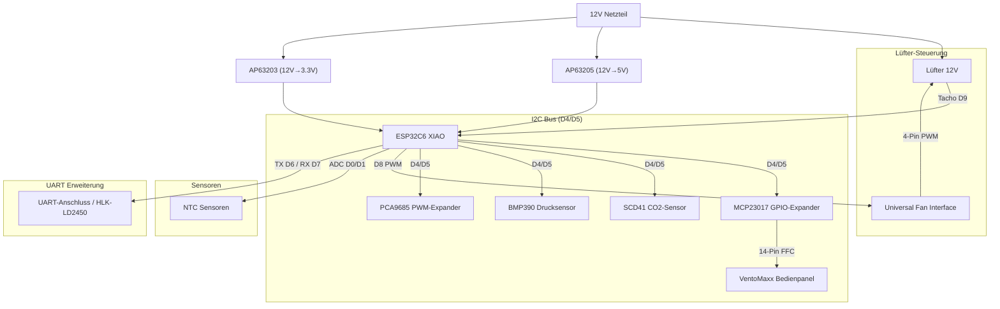

# 🌬️ VentoSync — Intelligente WRG-Wohnraumlüftungssteuerung auf Basis von ESPHome für VentoMaxx V-WRG Serie (ESP32-C6)

[](Readme.md)

## ⚖️ Disclaimer

> ⚠️ **VentoSync ist ein unabhängiges Community-Projekt und steht in keiner Verbindung zur Ventomaxx GmbH.**

## 🚀 Zusammenfassung & Überblick

Dieses Open-Source-Projekt bietet eine professionelle, dezentrale Lüftungssteuerung basierend auf ESPHome. Es ersetzt die Steuerung der VentoMaxx V-WRG Serie mittels einer eigens dafür entwickelten Platine (PCB) und steuert damit den reversierbaren 12V Lüfter zur Wärmerückgewinnung, überwacht optional die Luftqualität (CO2, Feuchte und Temperatur) mittels eines hochwertigen Sensirion SCD41 Sensors, berechnet die effektive Wärmerückgewinnung und nutzt das **originale VentoMaxx Bedienpanel** für eine nahtlose Integration, intuitive Steuerung. Darüber hinaus kann optional ein Radar-Sensor zur Anwesenheitserkennung integriert werden, der unsichtbar hinter der Blende des Lüftungsgerätes montiert werden kann.
Die Kommunikation zwischen den einzelnen Lüftungsgeräten erfolgt über das ESP-NOW Protokoll, sodass kein WLAN oder eine zentrale Steuereinheit erforderlich sind (die Kommunikation über die Stromleitungen, welche Ventomaxx nutzt, wird nicht verwendet).

> 💡 **Kompatibilität:** Die Steuerung funktioniert prinzipiell für jede dezentrale Wohnraumlüftung mit einem reversierbaren 12V Lüfter (3-PIN oder 4-PIN PWM). Sie wurde jedoch **speziell als Ersatz für die VentoMaxx V-WRG Serie** entwickelt. Die Hardware (PCB-Layout/Größe und Bedienpanel) ist damit explizit für die VentoMaxx V-WRG Serie optimiert und muss für andere Hersteller ggf. angepasst werden. Das PCB ist so konzipiert, dass es exakt in das Gehäuse der VentoMaxx V-WRG Serie passt und die vorhandenen Befestigungspunkte nutzt.
Achtung: Diese Lösung ist nicht kompatibel mit der VentoMaxx ZR-WRG Serie, da diese eine zentrale Steuereinheit nutzt!

[](https://github.com/thomasengeroff-dotcom/VentoSync/actions/workflows/build.yaml)
[](https://github.com/thomasengeroff-dotcom/VentoSync/releases)
[](https://esphome.io/)
[](https://www.home-assistant.io/)
[](https://esphome.io/components/esp32.html)


---

## 📑 Inhaltsverzeichnis

- [⚖️ Disclaimer](#⚖️-disclaimer)
- [🚀 Zusammenfassung & Überblick](#🚀-zusammenfassung--überblick)
  - [Motivation](#motivation)
  - [🛠️ Maßgefertigte Leiterplatte (PCB)](#🛠️-maßgefertigte-leiterplatte-pcb)
  - [🔄 Vergleich mit VentoMaxx V-WRG](#🔄-vergleich-mit-ventomaxx-v-wrg)
- [✨ Leistungsmerkmale](#✨-leistungsmerkmale)
  - [⚙️ Intelligente Betriebsmodi](#⚙️-intelligente-betriebsmodi)
  - [🛡️ Präzisions-Sensorik & Monitoring](#🛡️-präzisions-sensorik--monitoring)
  - [⚡ Extrem niedriger Stromverbrauch](#⚡-extrem-niedriger-stromverbrauch)
  - [🖥️ Bedienung am Lüftungsgerät](#🖥️-bedienung-am-lüftungsgerät)
  - [🏠 Home Assistant Integration](#🏠-home-assistant-integration)
  - [📊 VentoSync Dashboard - Lokales Web-Dashboard](#📊-ventosync-dashboard---lokales-web-dashboard)
- [📡 ESP-NOW: Kabellose Autonomie](#📡-esp-now-kabellose-autonomie)
  - [Vorteile im Überblick](#vorteile-im-überblick)
  - [Discovery-Ablauf](#discovery-ablauf)
- [🗺️ Roadmap & Zukünftige Erweiterungen](#🗺️-roadmap--zukünftige-erweiterungen)
- [🎛️ Eigene Platine - PCB](#️-eigene-platine---pcb)
  - [Passgenaues SCD41 Sensor Board](#specialized-scd41-sensor-board)
- [🛠️ Hardware & Bill of Materials (BOM)](#🛠️-hardware--bill-of-materials-bom)
  - [Zentrale Einheit](#zentrale-einheit)
  - [Aktoren & Sensoren](#aktoren--sensoren)
  - [🖱️ Bedienpanel am Gerät](#🖱️-bedienpanel-am-gerät)
- [🔌 Pinbelegung & Verkabelung](#🔌-pinbelegung--verkabelung)
  - [📊 Schematische Darstellung (Konzept)](#📊-schematische-darstellung-konzept)
- [🛠️ Einrichtung & Installation](#🛠️-einrichtung--installation)
  - [1. Entwicklungsumgebung (Linux venv & ESPHome-CLI)](#1-entwicklungsumgebung-linux-venv--esphome-cli)
  - [2. Konfiguration & Kompilierung](#2-konfiguration--kompilierung)
  - [3. Erstmaliges Flashen & Inbetriebnahme](#3-erstmaliges-flashen--inbetriebnahme)
  - [4. OTA-Updates & Home Assistant Integration](#4-ota-updates--home-assistant-integration)
  - [Kalibrierung der NTCs](#kalibrierung-der-ntcs)
- [🎮 Bedienung & Steuerung](#🎮-bedienung--steuerung)
  - [🖐️ Bedienpanel (VentoMaxx Style)](#🖐️-bedienpanel-ventomaxx-style)
  - [🔄 Detaillierte Betriebsmodi (Programme)](#🔄-detaillierte-betriebsmodi-programme)
  - [📱 Steuerung über Home Assistant](#📱-steuerung über-home-assistant)
- [🧠 Wärmerückgewinnung - So funktioniert's](#🧠-wärmerückgewinnung---so-funktionierts)
  - [Grundprinzip](#grundprinzip)
  - [Betriebszyklus (50s bis 70s pro Phase)](#betriebszyklus-50s-bis-70s-pro-phase)
  - [Phase 1: Abluft (Rausblasen) - 70 Sekunden](#phase-1-abluft-rausblasen---70-sekunden)
  - [Phase 2: Zuluft (Reinblasen) - 70 Sekunden](#phase-2-zuluft-reinblasen---70-sekunden)
  - [NTC Sensoren (Temperatur-Stabilisierung)](#ntc-sensoren-temperatur-stabilisierung)
  - [Luftqualität & Gassensorik (BME680)](#luftqualität--gassensorik-bme680)
  - [Effizienzberechnung (Energiebasiert)](#effizienzberechnung-energiebasiert)
  - [Optimierung der Effizienz](#optimierung-der-effizienz)
  - [Synchronisation mehrerer Geräte](#synchronisation-mehrerer-geräte)
- [🔧 Technische Details & Optimierungen](#🔧-technische-details--optimierungen)
- [📁 Projektstruktur](#📁-projektstruktur)
- [🏗️ Code-Architektur & Wartbarkeit](#🏗️-code-architektur--wartbarkeit)
- [🚀 Automatisierte Release & Versionierung](#🚀-automatisierte-release--versionierung)
- [⚠️ Sicherheitshinweise](#⚠️-sicherheitshinweise)
- [Suchbegriffe](#suchbegriffe)
- [⚖️ Rechtlicher Haftungsausschluss](#⚖️-rechtlicher-haftungsausschluss)
- [📜 Lizenz](#📜-lizenz)

---

## Motivation

Ich habe vor vielen Jahren im Rahmen der Haussanierung die dezentrale Wohnraumlüftung V-WRG von Ventomaxx installiert (10 Geräte) und war damit auch sehr zufrieden. Allerdings hat mich die proprietäre Steuerung und die fehlende Integration in mein Smart Home System immer gestört. Daher habe ich mich entschlossen, eine eigene Platine (PCB) inkl. der Steuerungssoftware auf Basis von ESPHome zu entwickeln, da es keine fertige Lösung gab. Diese Lösung ist Open Source und soll anderen Nutzern helfen, die in der gleichen Situation wie ich sind.
Für die Steuerung der Lüftung auf Basis von CO2 nutze ich einen extrem hochwertigen und präzisen CO2-Sensor (Sensirion SCD41), der direkt in die Platine (per kleines Zusatz-PCB) integriert ist (Hinweis: Aktuell dient der BME680 als Fallback, da das SCD41-PCB noch in Fertigung ist). Dieser Sensor misst die echte CO2-Konzentration in der Luft und steuert die Lüftungsintensität entsprechend der Voreinstellungen (mittels einer modernen PID-Regelung). Sämtliche Code-Kommentare und die interne Dokumentation wurden zur besseren internationalen Wartbarkeit auf Englisch umgestellt, während das User-Interface weiterhin auf Deutsch bleibt.
Da die Lüftungsgeräte in den verschiedenen Räumen meistens eine sehr zentrale Position haben, nutze ich diese auch direkt zur Anwesenheitserkennung mittels Radar-Sensor, der unsichtbar hinter der Blende des Lüftungsgerätes versteckt montiert werden kann. Der Anwesenheitssensor wird für die Steuerung der Lüftungsintensität im Smart-Automatik Modus genutzt und kann darüber hinaus in Home Assistant für jegliche weitere Automatisierungen genutzt werden.
Der Funktionsumfang dieser Eigenentwicklung geht nach meinen Recherechen über alles hinaus, was aktuell am Markt der Lüftungsgeräte zu finden ist!

---

## 🛠️ Maßgefertigte Leiterplatte (PCB)

Das Herzstück des Projekts ist eine eigens entwickelte Platine, die exakt in das vorhandene Gehäuse der VentoMaxx-Geräte passt.


> [!TIP]
> Wenn du Interesse an einer Platine für deine eigenen Geräte hast, kannst du mich gerne unter **<thomas@engeroff.net>** kontaktieren.
> Bitte beachte, dass ich noch nicht entschieden habe, ob ich die PCB-Produktionsdaten als Open Source zur Verfügung stellen werde.


> [!CAUTION]
> **LEBENSGEFAHR (230V Netzspannung):** Der Einbau des PCB in das Lüftungsgerät erfordert Arbeiten an der **230V Netzspannung**. Installation und elektrischer Anschluss dürfen **ausnahmslos nur von einer qualifizierten Elektrofachkraft** unter Beachtung der geltenden Sicherheitsvorschriften durchgeführt werden!

---

## 🔄 Vergleich mit VentoMaxx V-WRG

Diese Lösung ist ein **Drop-in Replacement** für die [VentoMaxx V-WRG / WRG PLUS](https://www.ventomaxx.de/dezentrale-lueftung-produktuebersicht/aktive-luefter-mit-waermerueckgewinnung/) Steuerung — mechanisch kompatibel, funktional massiv erweitert:

| | VentoMaxx (Original) | ESPHome Smart WRG |
| :--- | :---: | :---: |
| Betriebsmodi | 3 | **5+** (inkl. Automatiken) |
| Sensorik | 0-1 (opt. VOC) | **6** (CO2, Temp, Feuchte, Druck, Radar, Tacho) |
| Lüfterregelung | 3 feste Stufen | **10 Stufen (diskrete PID-Regelung)** |
| Smart Home | ❌ | ✅ Home Assistant (nativ) |
| Wartungsalarm | Timer-LED | ✅ Prädiktiv + Push |
| Synchronisation | Stromleitung | ✅ Kabellos (**ESP-NOW Protocol**) & Echtzeit-Sync |
| Updates | nur per Servicetechniker (muss eingeschickt werden) | ✅ Over-the-Air (OTA) |
| Versionierung | Manuell | ✅ Vollautomatisch (Patch-Level) |
| Erweiterbarkeit | ❌ | ✅ System kann mit zusätzlichen Sensoren und Aktoren oder individuellen Funktionen erweitert werden |
| Lizenz | Proprietär | ✅ Open Source (GPL v3) |

 **Den vollständigen Feature-für-Feature Vergleich mit allen technischen Details findest du in [📄 Comparison-VentoMaxx.md](documentation/Comparison-VentoMaxx.md).**

---

## ✨ Leistungsmerkmale

### ⚙️ Intelligente Betriebsmodi

Alle Geräte in einem Raum finden sich beim Start oder Raumwechsel vollautomatisch über eine **dynamische ESP-NOW Discovery** und kommunizieren anschließend effizient via Unicast.

- 🤖 **Smart-Automatik**: Vollautomatische Steuerung für maximalen Komfort und Effizienz. Standardbetrieb in Wärmerückgewinnung (Push-Pull) mit dynamischer PID-Regelung für CO2 und Luftfeuchtigkeit unter Einbezug aktueller Außenluftbedingungen. Im Sommer wird Querlüftung zur passiven nächtlichen Kühlung automatisch aktiviert, wenn es außen kühler ist als innen. *→ [Vollständige Details und Zeitbeispiele ↓](#1--smart-automatik-standard--empfohlen----led_wrg--pulsiert-langsam)*
- 🔄 **Effiziente Wärmerückgewinnung**: Zyklischer, bidirektionaler Betrieb (Push-Pull) zur Maximierung der Energieeffizienz. Während die automatische CO2- und Feuchteregelung inaktiv ist, kann die Anwesenheitserkennung die Lüfterstufe bei Bedarf dynamisch anpassen.
- 💨 **Querlüftung (Sommerbetrieb)**: Konstanter Luftstrom ohne Richtungswechsel (Phase-A-Geräte saugen an, Phase-B-Geräte blasen gleichzeitig ab für einen spürbaren Durchzug zur passiven Nachtkühlung). Flexibel konfigurierbar via Timer oder als Dauerbetrieb.
- 🚀 **Stoßlüftung**: Intensivlüftung für schnellen Luftaustausch. Das Gerät lüftet für 15 Minuten mit der **manuell gewählten Intensität** und pausiert anschließend für 105 Minuten, um Feuchtigkeit effektiv abzuführen und den Keramikspeicher zu regenerieren. Danach wiederholt sich der Zyklus.
- 🌡️ **Aus (Monitoring-Modus)**: Der Lüfter wird gestoppt (0 RPM), aber alle Sensoren (CO2, Temp, Radar) und das Web-Dashboard bleiben für lückenlose Messdaten in Home Assistant aktiv. *(Hinweis: Der extrem stromsparende Light-Sleep mit deaktiviertem WLAN wird per langem Tastendruck >5s auf den Power-Button aktiviert).*

### 🛡️ Präzisions-Sensorik & Monitoring

- 🌡️ **Klimadatenerfassung**: Hochpräzise Messung von Temperatur und relativer Luftfeuchtigkeit mittels [Sensirion SCD41](https://sensirion.com/de/produkte/katalog/SCD41).
  - ✅ **Photoacoustic sensing** für präzise CO2-Messung (400-5000 ppm), Integrierte Temperatur- und Feuchtigkeitsmessung (SCD41), Dokumentation: `EasyEDA-Pro/components/SCD41-Sensirion.pdf`
  - ✅ **BME680 Advanced IAQ Engine**: Der BME680 nutzt nun eine dedizierte C++ Engine für robustes Baseline-Tracking, dynamische Temperaturkompensation und intelligentes Flash-Wear-Leveling. Dies liefert hochwertige VOC/IAQ-Daten ohne den Overhead der BSEC-Bibliothek.
  - ⚠️ **Hinweis:** Da das SCD41-PCB noch in Fertigung ist, dient der **BME680** aktuell als Fallback (IAQ-Index). Der Code erkennt automatisch, ob der SCD41 vorhanden ist.
  - 💨 **Echte CO2-Messung**: Der SCD41 nutzt **photoacoustic sensing** zur direkten CO2-Messung (400-5000 ppm) statt berechneter Äquivalente - ideal für bedarfsgerechte Lüftungssteuerung.
  - 🏔️ **Luftdruckmessung & Hardware-Schutz via BMP390**: Der hochpräzise Barometer-Sensor [Bosch BMP390](https://www.bosch-sensortec.com/en/products/environmental-sensors/pressure-sensors/pressure-sensors-bmp390.html) liefert nicht nur lokale Wetterdaten und barometrische Kompensation für den SCD41, sondern fungiert auch als **Sicherheitswächter für das Traco-Netzteil**:
    - **Automatisches Derating-Management**: Überwachung der Innentemperatur im Gehäuse des Lüftungsgerätes zur Einhaltung der Traco-Spezifikationen.
    - **Not-Abschaltung**: Bei kritischen Temperaturen (>60°C) startet ein Sicherheits-Protokoll (Lüfterstopp und 60min Deep Sleep), um die Hardware vor Überhitzung zu schützen und eine entsprechende Warnung an Home Assistant zu senden.

- **💨 Fortgeschrittene Luftqualitäts-Logik**:
  - **Enthalpie-Schutz / Absolute Feuchtigkeits-Sperre**: Anders als herkömmliche Systeme, die nur die relative Luftfeuchtigkeit vergleichen (was irreführend ist — kalte Luft bei 90% rH enthält weit weniger Wasser als warme Luft bei 50% rH), berechnet VentoSync die **absolute Luftfeuchtigkeit** in g/m³ mittels [Magnus-Formel](https://de.wikipedia.org/wiki/Clausius-Clapeyron-Gleichung). Die feuchtigkeitsgesteuerte Lüftung wird **nur aktiviert, wenn die Außenluft tatsächlich trockener** ist als die Innenluft. Ist die Außenluft feuchter, wird der Feuchtigkeits-Bedarf auf **null** gesetzt — das System importiert keine Feuchtigkeit, selbst wenn der Feuchtigkeits-PID-Regler mehr Lüftung anfordert.

    | Szenario | Innen | Außen | Absolute Feuchtigkeit | Ergebnis |
    | --- | --- | --- | --- | --- |
    | ☀️ **Normaler Sommertag** | 23°C / 55% rH | 20°C / 45% rH | Innen: 11,3 g/m³ **>** Außen: 7,8 g/m³ | ✅ Lüften hilft → Feuchtigkeits-Demand aktiv |
    | 🌧️ **Regentag / Schwüle** | 23°C / 55% rH | 18°C / 90% rH | Innen: 11,3 g/m³ **<** Außen: 13,8 g/m³ | 🛑 Außenluft feuchter → Feuchtigkeits-Demand = 0 |
    | ❄️ **Winternacht** | 21°C / 45% rH | −5°C / 80% rH | Innen: 8,3 g/m³ **>** Außen: 2,6 g/m³ | ✅ Kalte Luft ist sehr trocken → Lüften hilft |

    > [!TIP]
    > Dieses Feature hebt VentoSync von den meisten kommerziellen WRG-Geräten ab, die blind auf Basis der relativen Luftfeuchtigkeit lüften und dadurch die Raumfeuchtigkeit bei Regen oder Schwüle sogar **erhöhen** können.

    Falls beide Temperatursensoren ausfallen, greift ein Fallback, der die relative Feuchtigkeit direkt vergleicht. Details in der [📄 Automatic-Mode-Logic.md](documentation/Automatic-Mode-Logic.md).
- 📊 **Echte VentoMaxx V-Kennlinie**: Basierend auf den physikalischen Parametern der Original-Hardware (50% PWM = Stopp-Zone), wurde die Kennlinie jedoch in den niedrigeren Stufen (Stufe 1-6) feiner abgestimmt, um akustisch noch dezenter zu bleiben.
- 🪟 **Fenstersperre (Window Guard)**: Automatischer raumweiter Lüftungsstopp bei offenen Fenstern mit 5s Verzögerung, automatischem Fortsetzen und Master-LED-Feedback.
  > 👉 *Einrichtungsanleitung & Details: [📄 Fenstersperre Setup Guide](documentation/Window-Guard-HA-Setup-DE.md).*

- 🌟 **Erweiterte Komfort- & Schutzfunktionen**:
  - 📈 **Phasen-Kontinuität & Sanftanlauf**: Proportionalskalierung bei Stufenwechseln und sanfte Geschwindigkeitsübergänge (~5%/s) für minimalen Verschleiß und leisen Betrieb.
  - 🔄 **Echtzeit-Diagnose**: Klartext-Richtungsanzeige (*Zuluft*, *Abluft*, *Stillstand*) und virtuelle Drehzahlberechnung (4200 RPM @ 100%).
  - 🌴 **Urlaubsmodus**: Automatischer Energiesparbetrieb mit konfigurierbarem Modus/Stufe bei längerer Abwesenheit.
  - 🔒 **Kindersicherung**: Sperrung der Gerätetasten über Home Assistant oder per Tastenkombination (5s Modus/Stufe halten) mit LED-Feedback.
  > 👉 *Ausführliche Dokumentation, Parameter & Funktionsweise siehe [📄 Komfort- und Sicherheitsfunktionen](documentation/Komfort-und-Sicherheitsfunktionen.md).*

### ⚡ Extrem niedriger Stromverbrauch

Das VentoMaxx System mit dieser ESPHome Steuerung arbeitet überragend effizient. Durch die Nutzung eines hochwertigen Traco-Netzteils und der präzisen PWM-Steuerung des ebm-papst Motors liegt die reine Wirkleistung (gemessen an 230V) in einem Bereich, der viele kommerzielle Anlagen deutlich unterbietet:

- **Stufe 1 (Grundlüftung):** ~2,7 - 2,9 Watt *(ca. 7,36 € / Jahr)*
- **Stufe 5 (Erhöhte Last):** ~3,2 - 3,7 Watt *(ca. 9,10 € / Jahr)*
- **Stufe 10 (Maximalleistung):** ~5,0 - 6,0 Watt *(ca. 15,75 € / Jahr)*

Selbst bei ganzjährigem 24/7-Dauerbetrieb auf der *absoluten Maximalstufe (10)* belaufen sich die nominellen Stromkosten (bei 0,30 €/kWh) auf lediglich rund 15 Euro im Jahr. Im meist genutzten Automatik-Modus (Werte pendeln nachts oder bei Abwesenheit auf Stufe 1 bis 3) liegen die realen Betriebskosten bei extrem sparsamen **ca. 7 bis 8,50 Euro pro Jahr** für die gesamte Einheit.

> **Hinweis**: Es handelt sich hierbei um keine 100% akkurate Labormessung. Ich habe diese Werte mittels eines Shelly 1PM mini ermittelt.

*Besonders bemerkenswert: In diese Messwerte ist der durchgängige Betrieb aller verbauten Komponenten eingeflossen – inklusive der ESP32-Steuerung (WLAN/ESP-NOW), der Klima- und CO2-Sensoren sowie dem kontinuierlich messenden mmWave-Radar-Anwesenheitssensor!*

### 🖥️ Bedienung am Lüftungsgerät

Um ein intuitives und optimales Bedienerlebnis zu gewährleisten, wird das originale Bedienpanel des VentoMaxx V-WRG-1 (9 LEDs, 3 Taster) vollständig beibehalten und um 10 Lüftungsstufen, Gruppen-Synchronisation (Wake-up Effekt) sowie intelligente LED-Diagnose-Blinkcodes erweitert.


> 👉 *Ausführliche Anleitung zu Tastenkombinationen, 10-Stufen-Balkenanzeige und Diagnose-Blinkcodes siehe [📄 Bedienungsanleitung Lüftungsgerät](documentation/Bedienung-Lueftungsgeraet.md).*

### 🏠 Home Assistant Integration

**Vollständige Home Assistant Integration**: Native Unterstützung der **ESPHome Native API** für hochperformantes Echtzeit-Monitoring und Steuerung. Im Gegensatz zum herkömmlichen MQTT nutzt die Native API hochoptimierte Protocol Buffers für minimale Latenz und geringsten Ressourcenverbrauch.

- **Sofortige Synchronisierung**: Zustandsänderungen werden sofort übertragen, mit bis zu 10-mal kleineren Nachrichtengrößen als bei MQTT.
- **Zero-Configuration**: Automatische Erkennung in Home Assistant – keine manuelle Einrichtung von Entitäten oder ein MQTT-Broker erforderlich.
- **Sicherheit auf Enterprise-Niveau**: Verschlüsselte Kommunikation über das Noise-Protokoll mit Pre-Shared Keys.

**Hybride Integrations-Philosophie**: Während der **Hauptfokus** von VentoSync auf einer tiefen und nahtlosen Integration in **Home Assistant** liegt, bietet das Projekt auch eine leistungsstarke Alternative. Durch das integrierte **lokale Web-Dashboard** kann das System als **voll funktionsfähige Standalone-Lösung** genutzt werden. Dies ermöglicht es Anwendern, den vollen Funktionsumfang – von der automatisierten Lüftung bis zur Sensordiagnose – zu nutzen, ohne jemals eine Home Assistant-Instanz einrichten oder warten zu müssen.

#### 📊 VentoSync Dashboard - Lokales Web-Dashboard

Für VentoSync ist kein Home Assistant oder Smart-Home-Server zwingend erforderlich: Jedes Lüftungsgerät stellt eine eigene, direkt im Webbrowser (auf Smartphone, Tablet oder PC) aufrufbare Benutzeroberfläche bereit — so kannst du Raumluftwerte live überwachen, Betriebsmodi steuern und Einstellungen vornehmen, ganz ohne App- oder Software-Installation.

<p align="center">
  
  &nbsp;
  
</p>

> 👉 *Vollständige Funktionsübersicht, ESP-NOW Live-Visualisierung und Standard-ESPHome-Interface siehe [📄 Lokales Web-Dashboard Guide](documentation/Lokales-Web-Dashboard.md).*

## 📡 ESP-NOW: Kabellose Autonomie

Die VentoSync-Geräte kommunizieren direkt untereinander über [ESP-NOW](https://esphome.io/components/espnow.html) — ein schnelles, verbindungsloses 2,4-GHz-Funkprotokoll von Espressif.

Ich habe mich hier bewusst **gegen die fehleranfällige Kommunikation über die Stromleitung (Powerline / PLC)** wie beim originalen VentoMaxx-System entschieden: Die Datenübertragung über das 230V-Stromnetz leidet im Alltag oft unter Phasenproblemen und Störsignalen, während herkömmliches WLAN von einem funktionierenden Router abhängt. **ESP-NOW** bietet den idealen, modernen Mittelweg — eine extrem zuverlässige, blitzschnelle und direkte Funkverbindung, die vollkommen autonom und unabhängig vom normalen WLAN-Netzwerk arbeitet und keinerlei Steuerleitungen erfordert.

<p align="center">
  
</p>

> 👉 *Ausführliche Details zu Protokoll v4, dynamischer Raum-Discovery, Unicast-Architektur und Antennen-Optimierung siehe [📄 ESP-NOW Kommunikation Guide](documentation/ESP-NOW-Kommunikation.md).*

---

## 🗺️ Roadmap & Zukünftige Erweiterungen

VentoSync wird aktiv gepflegt und kontinuierlich weiterentwickelt, mit Fokus auf tiefere Sensorfusion, akustische Optimierung und moderne Gebäudeautomation.

> 👉 *Detaillierte Beschreibungen und Konzepte aller geplanten Features und Roadmap-Meilensteine siehe [📄 Roadmap & Zukünftige Erweiterungen](documentation/Roadmap-und-Zukuenftige-Erweiterungen.md).*

## 🎛️ Eigene Platine - PCB

Eine eigens entwickelte Platine (PCB) wurde entworfen, um alle Kernkomponenten (XIAO ESP32-C6, Traco Power DC/DC-Wandler, Pegelwandler) in einer kompakten und robusten Einheit zu vereinen. Die Platinen werden von JLCPCB gefertigt und befinden sich aktuell in der finalen Validierungsphase.

**Wichtige Design-Prinzipien:**

- **Zuverlässigkeit auf Industrieniveau**: Die Komponenten wurden für eine voraussichtliche Lebensdauer von >10 Jahren im 24/7-Dauerbetrieb ausgewählt.
- **Sicherheit an erster Stelle**: Trotz des geringen Stromverbrauchs folgt das Layout strengen Sicherheitsstandards, um Brandschutz und Spannungsstabilität zu gewährleisten.
- **Zukunftssichere Erweiterbarkeit**: Die Platine verfügt über dedizierte Erweiterungs-Header für zukünftige Upgrades:
  - **H4 (UART)**: Hochgeschwindigkeits-Serienverbindung (wird aktuell für das mmWave-Radar genutzt).
  - **H3 (I²C)**: Für zusätzliche Umgebungssensoren oder OLED-Displays.
  - **H1 (GPIO)**: 6 freie GPIOs inklusive 3,3V/GND für eigene DIY-Erweiterungen.


### Passgenaues SCD41 Sensor Board

Um die höchstmögliche Genauigkeit zu erzielen, wurde eine separate Platine speziell für den **Sensirion SCD41** entwickelt. Im Gegensatz zu generischen Breakout-Boards implementiert dieses Design die Referenzspezifikationen des Herstellers zur Entkopplung und hat genau die Dimensionen, so dass der Sensor an der exakten Zuluftöffnung positioniert werden kann:

- **Thermische Entkopplung**: Ein spezieller Frässchlitz und kupferfreie Zonen "entkoppeln" den Sensor thermisch von der Wärmekapazität der Hauptplatine.
- **Präzisionsfilterung**: Korrekte Entkopplungskondensatoren sind in unmittelbarer Nähe des Sensors platziert.
- **Perfekte Passform**: Entwickelt mit einem 1,25-mm-Pitch-Anschluss, der perfekt mit der Zuluftöffnung des VentoMaxx-Gehäuses ausgerichtet ist.


---

## 🛠️ Hardware & Bill of Materials (BOM)

### Zentrale Einheit

| Komponente | Beschreibung |
| :--- | :--- |
| **MCU** | [Seeed Studio XIAO ESP32C6](https://wiki.seeedstudio.com/xiao_esp32c6_getting_started/) (RISC-V, WiFi 6, Zigbee/Matter ready) |
| **Power** | TRACO POWER TMPS 10-112 (230V AC zu 12V DC, 10W) <br>– **Premium-Wahl:** Zertifiziert nach **EN 60335-1** (Haushaltsgeräte) und **EN 62368-1** (IT/Industrie). Die Wahl fiel auf dieses High-End-Modul von Traco Power (Schweiz), da es durch seine doppelte Isolierung (**Schutzklasse II**) und hohe Isolationsspannung (4kV) maximale Sicherheit bietet. Im Gegensatz zu günstigen Netzteilen erfüllt es die strengen EMV-Anforderungen der **Klasse B** ohne externe Filter und ist für den wartungsfreien Dauerbetrieb (>10 Jahre) in Wohnräumen ausgelegt. |
| **DC/DC** | Diodes Inc. AP63205 (12V->5V) & AP63203 (12V->3.3V) <br>– **Eigenentwicklung:** Diese zwei professionellen Abwärtswandler (Buck Converter) wurden für eine hocheffiziente Energiewandlung (bis zu 94% Effizienz) direkt auf dem PCB implementiert. Sie gewährleisten eine extrem stabile Spannungsversorgung für MCU und Sensorik bei minimaler Wärmeentwicklung – ein wesentlicher Faktor für die Langzeitstabilität des Systems im Dauerbetrieb. |

### Aktoren & Sensoren

| Komponente | Beschreibung | Dokumentation |
| :--- | :--- | :--- |
| **Lüfter** | Original Ventomaxx V-WRG (EBM-PAPST 4412 F/2 GLL) 3-Pin PWM oder AxiRev (4-Pin PWM) | [Fan Component](https://esphome.io/components/fan/speed.html) |
| **SCD41** | Sensirion CO2-Sensor (Echtes CO2 400-5000ppm, Temp, Hum) via I²C | [SCD4X Component](https://esphome.io/components/sensor/scd4x.html) |
| **BMP390** | Bosch Hochpräziser Barometrischer Drucksensor via I²C | [BMP3XX Component](https://esphome.io/components/sensor/bmp3xx.html) |
| **BME680** | Bosch Gas Sensor (Fallback für IAQ/Luftqualität) via I²C | [BME680 Component](https://esphome.io/components/sensor/bme680.html) |
| **NTCs** | 2x NTC 10k (Zuluft/Abluft) für Effizienzmessung | [NTC Sensor](https://esphome.io/components/sensor/ntc.html) |
| **I/O Expander** | **MCP23017** (I2C) für VentoMaxx Panel | [MCP23017](https://esphome.io/components/mcp23017.html) |
| **LED Driver** | **PCA9685** (I2C) für dimmbare LEDs im VentoMaxx Panel | [PCA9685](https://esphome.io/components/output/pca9685.html) |


*Lüfter-Anschlussbelegung mit Originalkabel.*

Die vollständige Stückliste (Bill of Materials) befindet sich im Unterordner [EasyEDA-Pro](EasyEDA-Pro) in der [BOM](EasyEDA-Pro/BOM_ESPHome%20VentoSync%20PWM_PCB_ESPHome-WRG_ESP32_PWM_2026-03-01.csv) .

### 🖱️ Bedienpanel am Gerät

| Komponente | Beschreibung | Dokumentation |
| :--- | :--- | :--- |
| **VentoMaxx Panel** | Original Panel (14-Pin FFC). 3 Taster, 9 LEDs (via PCA9685 dimmbar). | Die PIN-Belegung des Original-Panels wurde von mir vollständig durchgemessen und dokumentiert, um die exakte Ansteuerung über das eigene PCB und die Port-Expander (MCP23017/PCA9685) zu ermöglichen. |


---

## 🔌 Pinbelegung & Verkabelung

Das System basiert auf dem [Seeed XIAO ESP32C6](https://wiki.seeedstudio.com/xiao_esp32c6_getting_started/).

⚠️ **WICHTIG:** Der Lüfter läuft mit 12V, die Logik mit 3.3V oder auch 5V (radar sensor). Entsprechende Spannungsteiler und Schutzbeschaltungen sind vorhanden.

| XIAO Pin | GPIO | Funktion | Bemerkung |
| :--- | :--- | :--- | :--- |
| **D0** | GPIO0 | [ADC Input](https://esphome.io/components/sensor/adc.html) | NTC Außen (Abluft) |
| **D1** | GPIO1 | [ADC Input](https://esphome.io/components/sensor/adc.html) | NTC Innen (Zuluft) |
| **D2** | GPIO2 | Output | **MCP23017 Reset** |
| **D3** | GPIO21 | Output | **PCA9685 OE** (Output Enable) |
| **D4** | GPIO22 | [I2C SDA](https://esphome.io/components/i2c.html) | SCD41, BMP390, PCA9685, MCP23017 |
| **D5** | GPIO23 | [I2C SCL](https://esphome.io/components/i2c.html) | SCD41, BMP390, PCA9685, MCP23017 |
| **D6** | GPIO16 | [UART RX](https://esphome.io/components/uart.html) | **HLK-LD2450 Radar RX** |
| **D7** | GPIO17 | [UART TX](https://esphome.io/components/uart.html) | **HLK-LD2450 Radar TX** |
| **D8** | GPIO19 | [PWM Output](https://esphome.io/components/output/ledc.html) | **Fan PWM Primary** |
| **D9** | GPIO20 | [Pulse Counter](https://esphome.io/components/sensor/pulse_counter.html) | **Fan Tacho** (Pullup via 3V3) |
| **D10** | GPIO18 | - | Unbelegt (NC) |

### 📊 Schematische Darstellung (Konzept)



---

## 🛠️ Einrichtung & Installation

### 1. Entwicklungsumgebung (Linux `venv` & ESPHome-CLI)

Für eine stabile Entwicklungsumgebung wird dringend empfohlen, ESPHome in einer **virtuellen Python-Umgebung** (`venv`) zu installieren. Dies vermeidet Konflikte mit systemweiten Paketen und ist die einzige offiziell unterstützte manuelle Installationsmethode unter Linux.

```bash
# 1. Virtuelle Umgebung erstellen
python3 -m venv venv

# 2. Umgebung aktivieren
source venv/bin/activate

# 3. ESPHome installieren
pip install --upgrade esphome
```

*(Hinweis: Denke immer daran, `source venv/bin/activate` auszuführen, bevor du den Befehl `esphome` in einer neuen Terminal-Sitzung verwendest.)*

#### 🔄 Umgebung aktualisieren

Um deine Entwicklungsumgebung auf dem neuesten Stand zu halten, verwende die folgenden Befehle:

**ESPHome aktualisieren (innerhalb der venv):**

```bash
# Sicherstellen, dass venv aktiv ist
source venv/bin/activate
# Auf die neueste Version aktualisieren
pip install --upgrade esphome
```

**Vollständiges System- & Python-Update (Linux):**

```bash
# Paketliste aktualisieren und alle Systempakete upgraden
sudo apt update && sudo apt upgrade -y
```

**pip & setuptools aktualisieren (innerhalb der venv):**

```bash
pip install --upgrade pip setuptools
```

### 2. Konfiguration & Kompilierung

VentoSync nutzt eine modulare Hardware-Architektur. Wähle je nach verbauter Hardware die passende Konfigurationsdatei:

- **`ventosync.yaml`**: Vollversion (SCD41, BME680, LD2450)
- **`ventosync_bme680_only.yaml`**: Variante mit BME680 (ohne SCD41/LD2450)
- **`ventosync_radar_only.yaml`**: Variante mit Radar (ohne Klima-Sensoren)
- **`ventosync_nosensor.yaml`**: Basis-Lüftungssteuerung ohne Sensoren

Nutze das Skript `upload_all.sh` für automatisches Kompilieren und Flashen lokal auf deine Geräte:

```bash
# Kompiliert und flasht alle im Skript definierten Geräte
./upload_all.sh
```

Alternativ manuell für ein einzelnes Gerät per ESPHome CLI:

```bash
# 1. Konfiguration validieren (prüft auf YAML-Fehler)
esphome config ventosync_nosensor.yaml

# 2. Kompilieren & via OTA flashen (lädt automatisch auf die angegebene IP hoch)
esphome run ventosync_nosensor.yaml --device <IP-Adresse> --no-logs

# 3. Nur kompilieren (generiert die Binärdatei ohne Upload)
esphome compile ventosync_nosensor.yaml

# 4. Nur flashen (nützlich, wenn die Binärdatei bereits kompiliert wurde)
esphome upload ventosync_nosensor.yaml --device <IP-Adresse> --no-logs
```

### 3. Erstmaliges Flashen & Inbetriebnahme

1. **Firmware vorbereiten**: Kompiliere die Firmware mit deinen eigenen WLAN-Zugangsdaten (via `secrets.yaml`).
2. **Initiales Flashen**: Flashe den ESP (XIAO) initial per USB mit der VentoSync Firmware über das ESPHome Dashboard oder per ESPHome CLI-Befehl:

   ```bash
   esphome run ventosync.yaml --device /dev/ttyACM0
   ```

3. **Hardware-Einbau**:
   > [!CAUTION]
   > **LEBENSGEFAHR:** Der Einbau des PCB und ESP in das VentoMaxx Lüftungsgerät erfordert Arbeiten an der **230V Netzspannung**. Dieser Schritt darf **ausnahmslos nur von einer Elektrofachkraft** durchgeführt werden.
   Baue das PCB und den ESP gemäß Schaltplan in das Gehäuse des Lüftungsgerätes ein.
4. **Initiale Einrichtung (Captive Portal)**:
   Die kompilierten Firmware-Binaries auf GitHub sind "secret-free" und enthalten keine fest einkompilierten WLAN-Zugangsdaten. Wenn du ein OTA-Update mit diesen offiziellen Release-Dateien durchführst oder dein Gerät die WLAN-Verbindung verliert, befolge diese Schritte, um die WLAN-Verbindung wiederherzustellen:
   1. Suche mit deinem Smartphone oder PC nach dem WLAN **"VentoSync Hotspot"**.
   2. Verbinde dich mit dem Passwort: `ventosync`
   3. Es sollte sich automatisch ein Fenster (Captive Portal) öffnen. (Falls nicht, rufe im Browser `192.168.4.1` auf).
   4. Wähle dein Heim-WLAN aus der Liste aus und gib dein Passwort ein.
   **Fertig!** ESPHome hat nun deine Zugangsdaten dauerhaft im NVS-Flash gesichert. **Alle zukünftigen OTA-Updates werden diese Zugangsdaten automatisch nutzen und sich sofort verbinden.**
5. **Netzwerk-Konfiguration**: Hinterlege die IP-Adresse im Router als **feste IP (Static IP)**, um eine dauerhaft stabile Erreichbarkeit zu garantieren.

### 4. OTA-Updates & Home Assistant Integration

1. **Home Assistant Integration**: Füge das Gerät in Home Assistant unter der ESPHome-Integration hinzu (es wird i. d. R. sofort automatisch erkannt).
2. **Einstellungen anpassen**: Passe nach der Integration die folgenden Basis-Einstellungen in der Home Assistant UI oder dem lokalen Dashboard an:
   - **Device ID** (Eindeutige Nummer des Geräts)
   - **Room ID** (Geräte mit gleicher Room ID synchronisieren sich)
   - **Floor ID**
3. **Alternative - Web Dashboard**: Alternativ können (auch ohne Home Assistant) alle Settings über das lokale Web-Dashboard konfiguriert werden unter `http://<device-ip>` oder `http://<device-ip>/ui`.
4. **Spaß haben**: Genieße dein smartes, energieeffizientes Lüftungssystem!
5. **OTA-Updates**:
   Beispiel eines OTA Updates in Home Assistant:
   

### Kalibrierung der NTCs

Die Konfiguration ist optimiert für den NTC-Thermistor **[ENTC-10K9777-02](https://www.reichelt.de/de/de/shop/produkt/thermistor_ntc_-40_bis_125_c-350474)** (10kΩ, B-Wert 3435). Falls du andere Sensoren verwendest, müssen die Werte für `b_constant` und `reference_resistance` im YAML-Code entsprechend angepasst werden.

---

## 🎮 Bedienung & Steuerung

Die Steuerung erfolgt intuitiv über das integrierte Bedienpanel oder vollautomatisch via Home Assistant.

### 🖐️ Bedienpanel (VentoMaxx Style)

Das Panel verfügt über 3 Taster und 9 Status-LEDs.

#### Tastenbelegung

| Taste | Funktion | Bedienung |
| :--- | :--- | :--- |
| **Power (I/O)** | System Ein/Aus | • Kurz drücken: Schaltet Lüftung EIN/AUS (AUS: stoppt Lüfter, bleibt online im Monitoring-Modus; EIN: stellt Modus wieder her & beendet Light-Sleep)<br>• Lang (>5s): Versetzt das Gerät in den Light-Sleep-Modus (Lüfter/LEDs/WLAN aus)<br>• Sehr lang (>10s): Versetzt das Gerät in den Light-Sleep-Modus und startet den ESP32 neu (Reboot) |
| **Modus (M)** | Betriebsmodus | • Kurz drücken: Zykliert durch Automatik → WRG → Durchlüften → Stoßlüftung → Aus |
| **Stufe (+)** | Lüfterstärke | • Kurz drücken: Zykliert durch 10 Geschwindigkeitsstufen (angezeigt über 5 LEDs).<br>• **Gedrückt halten**: Automatisches Auf- und Ab-Durchlaufen der Stufen (1 Stufe pro Sekunde) bis zum Loslassen. |

#### Status-LEDs (Feedback)

| LED | Anzahl | Position | Verhalten |
| :--- | :---: | :--- | :--- |
| **Power** | 🟢 1x | LED Panel | Leuchtet hell im Betrieb. Dimmt nach 60s @ `ui_active_timeout` (Standard: 60s) auf 20% Helligkeit ab (statt ganz auszugehen). |
| **Master** | 🟢 1x | LED Panel | Leuchtet bei aktivem UI (Normalbetrieb). Signalisiert Störungen durch Blink-Muster: **2x**: Raum-Synchronisierung fehlgeschlagen | **3x**: WLAN-Verlust | **4x**: Hitze-Warnung (50-60°C). Bei über 60°C schaltet das Gerät automatisch ab. |
| **Modus L** (`LED_WRG`) | 🟢 1x | Links | **Pulsiert** im Smart-Automatik Modus. Dauerhaft an bei WRG oder Durchlüften. |
| **Modus R** (`LED_VEN`) | 🟢 1x | Rechts | Dauerhaft an bei Stoßlüftung oder Durchlüften. |
| **Intensität** | 🟢 5x | LED Panel | Zeigt aktuelle Lüfterstufe 1–10 (halbe/volle Helligkeit für 10 Stufen über 5 LEDs). Nur bei aktivem UI sichtbar. |

**Modus-LED Zuordnung (bei aktivem UI):**

| Modus | `LED_WRG` (links) | `LED_VEN` (rechts) |
| :--- | :---: | :---: |
| **Automatik (Standard)** | 🟢 (pulsiert langsam) | ⚫ |
| Wärmerückgewinnung (Eco) | 🟢 | ⚫ |
| Stoßlüftung | ⚫ | 🟢 |
| Durchlüften (Sommer) | 🟢 | 🟢 |
| Aus / System OFF | ⚫ | ⚫ |

> 💡 **60 Sekunden Auto-Dimming:** Alle Status-LEDs (Modus, Intensität, Master) erlöschen 60 Sekunden (konfigurierbar) nach dem letzten Tastendruck sanft. Die **Power-LED** bleibt dabei auf 20% gedimmt an. Bei jedem Tastendruck werden alle LEDs wieder aktiviert. Ausnahme: Die **Master-LED signalisiert Fehlerzustände weiter**, auch nach dem Timeout.

---

### 🔄 Detaillierte Betriebsmodi (Programme)

Über die **Modus-Taste (M)** zykliert das Gerät durch die Programme. Beim **Einschalten** ist **Modus 1 (Smart-Automatik)** aktiv.

> 💡 **Tipp:** Die Reihenfolge beim Tastendruck ist: **Automatik → WRG → Durchlüften → Stoßlüftung → Aus → Automatik...**

---

#### 1. 🤖 Smart-Automatik *(Standard / Empfohlen)* — `LED_WRG` 🟢 (pulsiert langsam)

**Dieser Modus ist der Standard beim Einschalten** und übernimmt vollautomatisch alle Steuerungsaufgaben. Die Lüftungsanlage regelt sich eigenständig basierend auf Umgebungsdaten und erfordert nach initialer HA-Konfiguration keinerlei manuelle Eingriffe ("Set and Forget").

**Aktive Smart-Features:**

| Feature | Sensor(en) | Schwellenwert |
| :--- | :--- | :--- |
| ✅ **CO2-Regelung (PID)** | SCD41 (`sensor.scd41_co2`) | `number.auto_co2_threshold` |
| ✅ **Feuchte-Management (PID)** | SCD41 (`sensor.scd41_humidity`) + HA `outdoor_humidity` | Über Außenfeuchte |
| ✅ **Sommer-Kühlfunktion** | NTC-Sensoren + ESP-NOW Gruppentemperatur | 22°C Innentemperatur |

**Logik im Detail:**

- **Grundbetrieb:** Wärmerückgewinnung (`MODE_ECO_RECOVERY`) auf Mindestlüfterstufe (`co2_min_fan_level`, Standard: 2). Die Wechselintervalle (Zyklusdauer) passen sich dabei dynamisch der aktuellen Lüfterstufe an (sanfte 70 Sekunden auf Stufe 1 bis schnelle 50 Sekunden auf Stufe 10) inkl. synchronisiertem NTC-Zeitfenster.

- **🎛️ Intelligente PID-Regelung — CO2 & Feuchtigkeit:** Anstatt den Lüfter einfach auf volle Leistung zu schalten, wenn Grenzwerte überschritten werden, nutzt VentoSync einen **PID-Regler**, um die Lüfterstärke präzise, stufenweise und vor allem leise zu regulieren.

  > **Was ist ein PID-Regler?**
  > Stell dir vor, du fährst Auto: Bist du nur knapp über dem Tempolimit, nimmst du kaum Gas raus. Bist du weit drüber, bremst du stärker. Und wenn du schon längere Zeit knapp drüber bist, drückst du etwas mehr auf die Bremse. VentoSync funktioniert mit CO2 und Luftfeuchte genauso — kein abruptes Schalten, sondern sanftes, kontinuierliches Nachregeln.

  Der Regler hat **zwei aktive Anteile**:

  - **P (Proportional)**: Reagiert *sofort* auf die Abweichung. Bei 100 ppm über dem Grenzwert: moderate Anforderung. Bei 500 ppm: spürbar höher.
  - **I (Integral)**: Das „Gedächtnis" des Reglers. Bleibt eine Abweichung *über längere Zeit* bestehen (z. B. weil Personen im Raum atmen), erhöht dieser Anteil die Anforderung langsam und stetig — bis sich die Luftqualität verbessert. Sinkt der CO2-Wert, baut sich der Integral-Anteil wieder ab.

  > [!NOTE]
  > Der Regler ist bewusst sehr langsam eingestellt (I-Anteil: `0.0000005`). Erst anhaltend erhöhte CO2-Werte über viele Minuten führen zu einer höheren Lüfterstufe.

  **Praxisbeispiel** — CO2-Grenzwert `800 ppm`, Lüfterbereich Stufe 2–7:

  | Zeit | CO2-Wert | Was passiert |
  | --- | --- | --- |
  | 0 min | 820 ppm | 20 ppm über Grenzwert → kleiner Bedarf → **Lüfter bleibt auf Stufe 2** (Minimum) |
  | 15 min | 870 ppm | 70 ppm drüber, Integral baut sich auf → **Lüfter bleibt auf Stufe 2** |
  | 30 min | 920 ppm | 120 ppm drüber, Integral akkumuliert → **Lüfter schaltet auf Stufe 3** |
  | 50 min | 960 ppm | CO2 steigt weiter, Integral ebenfalls → **Lüfter schaltet auf Stufe 4** |
  | 70 min | 900 ppm | CO2 fällt, Integral baut ab → **Lüfter kehrt auf Stufe 3 zurück** |
  | 90 min | 790 ppm | Unter Grenzwert, Bedarf → null → **Lüfter kehrt auf Stufe 2 zurück** |

  **Die wichtigsten Verhaltensregeln:**
  - Der Lüfter ändert sich um **maximal ±1 Stufe pro 10-Sekunden-Zyklus** — keine abrupten Sprünge.
  - Der Lüfter unterschreitet nie die konfigurierte **Mindeststufe** (Standard: Stufe 2) und überschreitet nie die **Maximalstufe** (Standard: Stufe 7).
  - CO2 ist das **primäre Regelsignal**, aber das System verwendet immer den **höheren** Bedarf aus CO2 und Feuchtigkeit — so wird keines der beiden Luftqualitäts-Kriterien jemals vernachlässigt.
  - Hat ein Gerät keine eigenen Sensoren, übernimmt es automatisch den höchsten Bedarf aus der Raumgruppe (via ESP-NOW).
  - Beim Wechsel *in* den Smart-Automatik-Modus werden alle Bedarfswerte auf null zurückgesetzt — der Lüfter **startet immer sanft von der Mindeststufe**, niemals direkt auf einer hohen Stufe.

- **💧 Feuchtigkeitsmanagement:** Der Feuchtigkeits-PID-Regler (`pid_humidity`) läuft kontinuierlich parallel zum CO2-Regler. Entfeuchtung wird aktiviert, wenn das Feuchtigkeitslimit überschritten wird (Standard: 60%) **und** die Außenluft tatsächlich trockener ist als die Innenluft (absolute Feuchtigkeitsprüfung via Magnus-Formel — nicht nur relative Feuchtigkeit). Ist die Außenluft feuchter (z. B. Regentag), wird der Feuchtigkeits-Bedarf auf null gesetzt. Siehe [Enthalpie-Schutz ↑](#präzisions-sensorik--monitoring) für Beispiele mit Vergleichstabelle.

- **Sommer-Kühlung:** Bei Innentemperatur > 22°C und kühlerem Außenbereich (mindestens 1,5°C kühler) wechselt das System automatisch in `Durchlüften` (Querlüftung). Phase-A- und Phase-B-Geräte im Raum blasen dabei gleichzeitig in entgegengesetzte Richtungen — echte Querlüftung. Sobald es außen wieder wärmer wird (Hysterese), kehrt das System zu WRG zurück.

- **Anwesenheit (Manuelle Modi):** In den Modi WRG, Durchlüften und Stoßlüftung wird die Lüfterstärke bei erkannter Präsenz dynamisch angepasst (Slider `-5` bis `+5`). Dies erlaubt einen bedarfsgerechten „Präsenz-Boost" ohne die Automatik-Regelung zu beeinflussen.

- **🌱 Energiespar-Modus (Light Sleep):** Aktivierbar durch langen Druck auf den Power-Button (>5s). Im Light Sleep werden Lüfter und WLAN deaktiviert und der LED-Treiber (PCA9685) komplett stromlos geschaltet. Ein einfacher Druck auf den Power-Button weckt das Gerät sofort wieder auf und synchronisiert es mit der Gruppe.

- **Gruppenlogik:** PID-Demand und Temperaturen werden sekündlich via ESP-NOW Unicast geteilt — alle entdeckten Geräte im Raum laufen synchron (die Lüfter skalieren identisch auf den höchsten Bedarf im Raum).

> **⚙️ Voraussetzung für das Feuchte-Management: `sensor.outdoor_humidity` in Home Assistant**
>
> Der ESPHome-Code erwartet die Entity-ID `sensor.outdoor_humidity` (in `sensors_climate.yaml`). Es gibt zwei Wege:
> **Option A (Wetterdienst):** Erstelle einen Template-Sensor basierend auf deiner Wetter-Integration (z.B. OpenWeatherMap).
> **Option B (Lokaler Sensor):** Erstelle einen Template-Sensor (Alias) oder passe die Entity-ID in der YAML an.
> *Ohne diesen Sensor funktioniert die Entfeuchtung trotzdem, der Outdoor-Check wird dann einfach übersprungen.*
Details siehe [Feuchte-Management-HA-Sensor.md](documentation/Feuchte-Management-HA-Sensor.md)

---

#### 2. ❄️ Wärmerückgewinnung (Eco Recovery) — `LED_WRG` 🟢

- **HA Entität:** `select.modus_lueftungsanlage` → `Eco Recovery`
- **Funktion:** Manueller WRG-Betrieb ohne die Smart-Automatik-Features. Die Luftrichtung wechselt zyklisch, Wärmeverlust wird um bis zu 85% reduziert.
- **Zykluszeiten:** Passen sich der Lüfterstufe an: Stufe 1: **70 Sek.**, Stufe 2: **65 Sek.**, … Stufe 5: **50 Sek.**
- **Synchronisation:** Phase A bläst hinein, Phase B hinaus — Geräte im Gegentakt, Haus druckneutral.

---

#### 3. 💨 Stoßlüftung — `LED_VEN` 🟢

- **HA Entität:** `button.stosslueftung_starten`
- **Funktion:** Intensivlüftung für schnellen Luftaustausch (z. B. nach dem Duschen oder Kochen).
- **Ablauf:** 15 Minuten intensiv lüften, 105 Minuten Pause, dann erneuter 15-Minuten-Zyklus (2 Std. Rhythmus). Wechselnde Startrichtung schützt den Keramikspeicher.

---

#### 4. 🌬️ Querlüftung / Durchlüften (Sommer) — `LED_WRG` 🟢 + `LED_VEN` 🟢

- **HA Entität:** `select.modus_lueftungsanlage` → `Ventilation` + `number.lueftungsdauer` (Timer, 0 = Endlos)
- **Funktion:** Konstanter Luftstrom ohne Richtungswechsel. Hälfte der Gruppe saugt an, andere Hälfte bläst ab → kühler Luftzug durch den Wohnraum.
- **Hinweis:** Im Automatik-Modus wird die Querlüftung **automatisch** bei hoher Innentemperatur aktiviert.

---

#### 5. ⭕ Aus (Monitoring-Modus) — beide LEDs ⚫

- **HA Entität:** `select.modus_lueftungsanlage` → `Off`
- **Funktion:** Lüfter und PWM-Ausgänge werden gestoppt (0 RPM). Alle Umweltsensoren (CO2, Temp, Radar) und das Web-Dashboard bleiben für unterbrechungsfreies Logging in Home Assistant aktiv. *(Hinweis: Für den stromsparenden Light-Sleep mit abgeschaltetem WLAN die Power-Taste >5s gedrückt halten).*

---

### 📱 Steuerung über Home Assistant

Alle Funktionen sind vollständig in Home Assistant integriert. Änderungen am Panel werden sofort synchronisiert.

#### Verfügbare Steuerungen

- **Lüfter**: Slider 0-10% bis 100% (entspricht intern den 10 Stufen des Bedienpanels)
- **Modus**: Auswahl (Smart-Automatik / Eco Recovery / Ventilation / Off)
- **Timer**: Konfiguration für "Durchlüften" (Standard: 30 Min)
- **LED-Helligkeit**: `number.max_led_brightness` (0-100%, Standard: 80%) zur Begrenzung der maximalen Panel-Helligkeit.
- **CO2-Grenzwert**: `number.auto_co2_threshold` (Im Automatik-Modus immer aktiv)
- **Diagnose**: Anzeige von RPM, Temperatur, Feuchte und **CO2-Gehalt (ppm)**

👉 **Tipp:** Eine detaillierte Übersicht aller verfügbaren Home Assistant Entitäten inklusive ihrer technischen Namen (`ID`) und Funktion findest du im Dokument **[Entities_Documentation.md](documentation/Entities_Documentation.md)**.

#### 📊 Lüftergeschwindigkeit pro Stufe (VentoMaxx V-Kennlinie)

Der original VentoMaxx Lüfter (**ebm-papst 4412 F/2 GLL**) wird über ein **einzelnes PWM-Signal** gesteuert. Die Kennlinie folgt einer V-Form (gemessen via Oszilloskop), wobei 50% PWM den Stillstand markiert:

| Stufe | Leistung | PWM Dir A (Abluft) | PWM Dir B (Zuluft) | RPM (ca.) |
| :---: | :---: | :---: | :---: | :---: |
| **OFF** | 0 % | 50.0 % | 50.0 % | 0 |
| **1** | 10 % | 30.0 % | 70.0 % | 420 |
| **2** | 16 % | 27.2 % | 72.8 % | 672 |
| **3** | 23 % | 24.4 % | 75.6 % | 966 |
| **4** | 31 % | 21.7 % | 78.3 % | 1302 |
| **5** | 40 % | 18.9 % | 81.1 % | 1680 |
| **6** | 50 % | 16.1 % | 83.9 % | 2100 |
| **7** | 61 % | 13.3 % | 86.7 % | 2562 |
| **8** | 73 % | 10.6 % | 89.4 % | 3066 |
| **9** | 86 % | 7.8 % | 92.2 % | 3612 |
| **10** | 100 % | 5.0 % | 95.0 % | 4200 |

Das Drehzahlband ist so optimiert, dass es in den niedrigen Stufen (Stufe 1-6) eine feinere Abstufung ermöglicht, um akustisch noch dezenter zu bleiben, während in den höheren Stufen die Leistung schneller ansteigt.
> ⚙️ **Mindestdrehzahl:** Stufe 1 entspricht 10 % Drehzahl (PWM nie auf 50 % = Stopp). Im Automatik-Modus (PID) wird die Drehzahl in **10 Stufen** zwischen `co2_min_fan_level` und `co2_max_fan_level` geregelt.
> 🔄 **Software-Fan-Ramping:** Bei jedem Richtungswechsel (WRG/Stoßlüftung) führt das System eine **5-sekündige sanfte Abbrems- und Anlauframpe** durch. Dies schont den Motor und minimiert Umschaltgeräusche. Die Intensitäts-LEDs zeigen währenddessen bereits den Zielwert an.

#### Automatische Funktionen

- **Unaffälligkeitsmodus**: Die LEDs werden automatisch ausgeschaltet, wenn keine Bedienung am Gerät erfolgt.
- **Filterwechsel-Alarm**: Prädiktive Wartungsbenachrichtigung (siehe unten).

#### 🧹 Filterwechsel-Alarm in Home Assistant einrichten

Das System trackt automatisch die Betriebsstunden des Lüfters und löst einen Alarm aus, wenn:

- **Betriebsstunden > 365 Tage** (8760h Laufzeit), oder
- **Kalenderzeit > 3 Jahre** seit dem letzten Filterwechsel.

**Verfügbare Entitäten:**

| Entität | Typ | Beschreibung |
| --- | --- | --- |
| `binary_sensor.filterwechsel_alarm` | Binary Sensor | `ON` = Filterwechsel empfohlen |
| `sensor.filter_betriebstage` | Sensor | Lüfter-Laufzeit in Tagen seit letztem Wechsel |
| `button.filter_gewechselt_reset` | Button | Nach Filterwechsel drücken → setzt Zähler zurück |

**Beispiel: Push-Benachrichtigung via HA Automation**

Füge folgende Automation in deine Home Assistant `automations.yaml` ein:

```yaml
automation:
  - alias: "Filterwechsel Benachrichtigung"
    trigger:
      - platform: state
        entity_id: binary_sensor.ventosync_filterwechsel_alarm
        to: "on"
    action:
      - service: notify.mobile_app_<dein_geraet>
        data:
          title: "🧹 Filterwechsel empfohlen"
          message: >-
            Die Lüftungsanlage hat {{ states('sensor.esptest_filter_betriebstage') }} Betriebstage
            seit dem letzten Filterwechsel erreicht. Bitte Filter prüfen und wechseln.
          data:
            tag: "filterwechsel"
            importance: high
```

> 💡 **Nach dem Filterwechsel:** Drücke den Button `Filter gewechselt (Reset)` in Home Assistant, um die Betriebsstunden und den Kalender-Timer zurückzusetzen.

---

## 🧠 Wärmerückgewinnung - So funktioniert's

### Grundprinzip

Das System nutzt einen **Keramikspeicher** zur Wärmerückgewinnung. Dieser speichert Wärme aus der Abluft und gibt sie an die Zuluft ab. Die Zykluszeit (Phase) variiert je nach Luftstufe zwischen **50s und 70s**, um die Energieeffizienz zu optimieren.

### Betriebszyklus (50s bis 70s pro Phase)


### Phase 1: Abluft (Rausblasen) - 70 Sekunden

```text
Innenraum (warm) → Keramikspeicher → Außen
    21°C              ↓ Wärme         5°C
                  speichern
```

**Was passiert:**

- 🔥 Warme Raumluft (21°C) strömt durch den Keramikspeicher
- 📈 Keramik erwärmt sich und speichert Energie
- 🌡️ **NTC Innen** misst am Ende die wahre Raumtemperatur
- 💨 Abgekühlte Luft (~10°C) wird nach außen geblasen

### Phase 2: Zuluft (Reinblasen) - 70 Sekunden

```text
Außen → Keramikspeicher → Innenraum (vorgewärmt)
 5°C     ↑ Wärme           ~16°C
        abgeben
```

**Was passiert:**

- ❄️ Kalte Außenluft (5°C) strömt durch den warmen Keramikspeicher
- 🔄 Keramik gibt gespeicherte Wärme ab
- 🌡️ **NTC Außen** misst Außentemperatur
- 🌡️ **NTC Innen** misst vorgewärmte Zuluft (~16°C)
- 🏠 Vorgewärmte Luft strömt in den Raum

### NTC Sensoren (Temperatur-Stabilisierung)

Die NTC Sensoren messen die Temperatur am Keramikspeicher innen und außen (`temp_zuluft` und `temp_abluft`). Da die Lüfterrichtung im Wärmerückgewinnungs-Modus zyklisch (z.B. alle 70 Sekunden) wechselt, benötigen die Sensoren aufgrund ihrer thermischen Masse eine gewisse Zeit, um sich an die neue Lufttemperatur anzupassen. Um die Messung möglichst genau zu machen, werden sehr kleine NTC Sensoren genutzt, mit möglichst geringer Masse und hoher Genauigkeit. Dadurch wird die Anpassung an die wechselnde Temperatur je nach Lüftungsrichtung möglichst schnell und präzise.
Um fehlerhafte Zwischenwerte in Home Assistant zu vermeiden und die wahren thermischen Grenzwerte exakt zu erfassen, nutzen beide Sensoren eine **intelligente, vereinheitlichte und phasengesteuerte Temperatur-Stabilisierung**:

- **Phase-Lock:** Das System verwirft Messwerte während der "falschen" Luftrichtung explizit (z.B. Innensensor während der Zuluft-Phase). Dies verhindert, dass der Puffer mit bereits erwärmter/gekühlter Luft verfälscht wird.
- **Thermische Wartezeit:** Nach einem Richtungswechsel (Push/Pull) wird die Messwertübertragung für **40% der Zyklusdauer (min. 15s)** pausiert, damit sich der NTC an den neuen Luftstrom anpassen kann.
- **Kombinierter Filter:** Alle Stufen (Phase-Lock, History-Invalidierung, Stabilitätscheck und saisonale Selektion) sind in einer einzigen, performanten C++ Funktion (`filter_ntc_combined`) vereint.
- **Dynamische Saison-Selektion:**
  - **Winter/Übergang:** Der Außensensor nimmt den Minimalwert (wahre kalte Außenluft), der Innensensor den Maximalwert (wahre warme Raumluft).
  - **Sommer-Kühlung:** Wenn die Außenluft heißer ist als die Innenluft, kehrt sich die Logik automatisch um (Außen nimmt Max, Innen nimmt Min).
- **Median-Fallback:** Sollte ein Referenzsensor temporär ausfallen, nutzt das System den Median der letzten 3 Werte als sicheren Kompromiss.
- **120s Failsafe-Timeout:** Ein großzügiger Watchdog hält die Sensoren in Home Assistant "online", auch wenn während langer Lüftungsphasen durch den Phase-Lock zeitweise keine Werte geliefert werden.

*Hinweis zur Redundanz:* `temp_zuluft` (Außen-NTC) liefert bei nach innen gerichtetem Luftstrom die tatsächliche Außentemperatur. `temp_abluft` (Innen-NTC) liefert bei nach außen gerichtetem Luftstrom die Raumtemperatur und dient als Redundanz zum präziseren SCD41 Sensor.

Konkret wird der folgende Sensor verwendet:

| Hersteller | Artikelnummer | Bezugsquelle | Genauigkeit | Datenblatt |
| :--- | :--- | :--- | :--- | :--- |
| **VARIOHM** | `ENTC-EI-10K9777-02` | [Reichelt Elektronik](https://www.reichelt.de/de/de/shop/produkt/thermistor_ntc_-40_bis_125_c-350474) | ± 0,2 °C | [PDF](EasyEDA-Pro/components/NTC_ENTC_EI-10K9777-02.pdf) |

### Luftqualität & Gassensorik (BME680)

Um präzise Daten zur Raumluftqualität (IAQ) zu liefern, verfügt das System über eine hochoptimierte **BME680 Advanced IAQ Engine**. Da die BSEC2-Bibliothek zu ressourcenintensiv ist, nutzt VentoSync eine eigene, thread-sichere C++ Implementierung:

- **Optimiertes Heater-Profil:** Der Gassensor arbeitet bei **300°C für 150ms** (Bosch-Empfehlung für IAQ). Dies reduziert die Eigenwärme und verlängert die Lebensdauer des Sensors im Vergleich zu Standardeinstellungen.
- **Dynamische Thermokompensation:** Die Temperaturwerte werden basierend auf der Umgebungstemperatur dynamisch korrigiert (interpolierter Offset zwischen -1,0°C und -2,0°C), um den thermischen Einfluss der Heizplatte auszugleichen.
- **Intelligentes Flash-Wear-Leveling:** Die Gas-Baseline wird nur dann im Flash-Speicher des ESP32 persistiert, wenn sie sich um mehr als **2%** geändert hat **und** mindestens **1 Stunde** vergangen ist. Dies schont die Lebensdauer des Speichers maximal.
- **Health-Watchdog:** Eine dedizierte Überwachungslogik erkennt I2C-Kommunikationsfehler oder "eingefrorene" Werte und meldet ein Sensorproblem an Home Assistant nach 10 aufeinanderfolgenden Fehlern.
- **Change-Detection Trend:** Die IAQ-Trend- und Bewertungs-Sensoren nutzen eine Change-Detection-Logik, um Netzwerkverkehr und Datenbankwachstum in Home Assistant zu minimieren.

### Effizienzberechnung (Energiebasiert)

Die wahre Wärmerückgewinnungseffizienz eines Keramikspeichers über einen vollständigen Zyklus ist energiebasiert, nicht basierend auf punktuellen Temperaturen (gemäß DIN EN 13141-8).

Am Ende der Zuluft-Phase berechnet das System die Effizienz mittels **numerischer Trapez-Integration** über die gesamte Phasendauer:

$$
\eta_{WRG} = \frac{\int (\text{T}_{Zuluft} - \text{T}_{Außen}) dt}{\int (\text{T}_{Raum} - \text{T}_{Außen}) dt}
$$

**Warum das mathematisch überlegen ist:**
Würde man die Effizienz als simplen Durchschnitt der momentanen Effizienzwerte berechnen, würde der Wert bei sehr kleinen Temperaturunterschieden ($\Delta T$) extrem ungenau und numerisch instabil werden (explodierende Werte) – etwa in der Übergangszeit. Durch die Integration der Temperaturdifferenzen über die Zeit bleibt die Berechnung physikalisch korrekt, stabil und liefert ein echtes Abbild der während des Zyklus zurückgewonnenen Wärmeenergie.

**Zurückgewonnene thermische Energie (Wh):**
Zusätzlich zur prozentualen Effizienz berechnet das System die tatsächlich zurückgewonnene thermische Energie in **Wattstunden (Wh)**. Dies erfolgt durch ein nicht-lineares Mapping der 10 Lüfterstufen auf die realen Volumenströme des Ventomaxx v-wrg-1 (von ca. 17 m³/h auf Stufe 1 bis zu 43 m³/h auf Stufe 10) und der Integration der tatsächlichen Temperaturdifferenz ($T_{Zuluft} - T_{Außen}$) über die Zeit. So lässt sich genau nachvollziehen, wie viel Heizenergie (oder Kühlenergie im Sommer) das System pro Zyklus "eingespart" hat.

**Interpretation:**

- **> 70%:** Ausgezeichnete Wärmerückgewinnung
- **50-70%:** Gute Wärmerückgewinnung
- **< 50%:** Keramik zu kalt, Zyklus zu kurz oder Temperaturdifferenz zu gering

### Optimierung der Effizienz

| Parameter                 | Auswirkung                          | Empfehlung      |
| :------------------------ | :---------------------------------- | :-------------- |
| **Zyklusdauer**           | Längere Zyklen = bessere Speicherung| 70-90s optimal  |
| **Lüftergeschwindigkeit** | Langsamer = mehr Wärmeübertragung   | 60-80%          |
| **Keramikvolumen**        | Mehr Masse = mehr Speicher          | Größer ist besser|
| **Außentemperatur**       | Kälter = höhere Effizienz möglich   | -               |

### Synchronisation mehrerer Geräte

Bei Verwendung mehrerer Geräte im gleichen Raum:

**Paar-Betrieb (2 Geräte):**

```text
Gerät A: Phase A (Zuluft)  ←→  Gerät B: Phase B (Abluft)
         ↓ 70s wechseln ↓
Gerät A: Phase B (Abluft) ←→  Gerät B: Phase A (Zuluft)
```

**Vorteile:**

- ✅ Kontinuierlicher Luftaustausch
- ✅ Keine Druckschwankungen
- ✅ Optimale Wärmerückgewinnung
- ✅ Synchronisiert über ESP-NOW

---

## 🔧 Technische Details & Optimierungen

Detaillierte technische Informationen zu Sensor-Optimierungen, ESPHome YAML Syntax, I²C-Konfiguration und weiteren technischen Aspekten findest du in der separaten Dokumentation:

📄 **[Technical-Details.md](EasyEDA-Pro/documentation/Technical-Details.md)**

Diese Dokumentation enthält:

- ESPHome YAML Syntax Best Practices
- I²C Bus Konfiguration
- SCD41 CO2-Sensor Konfiguration
- ESP-NOW Kommunikation
- Lüftersteuerung (PWM)

---

## 📁 Projektstruktur

```text
VentoSync/
├── .github/workflows/         # CI/CD (GitHub Actions) für Build & Release
├── components/                # Eigene C++-Komponenten für ESPHome
│   ├── ventilation_group/     # Kern-Zustandsmaschine und Koordination
│   ├── ventilation_logic/     # IAQ-Klassifizierung und Mathematik-Hilfsfunktionen
│   └── wrg_dashboard/         # Tailwind CSS & Chart.js Web-UI
├── documentation/             # Detaillierte technische Anleitungen und Datenblätter
├── EasyEDA-Pro/               # PCB-Designdateien (Schaltpläne, Layout, Stückliste)
├── ha_integration_example/    # Beispiele für HA-Dashboards & Slave-Knoten
├── json/                      # Deployment-Manifeste und Templates
├── packages/                  # Modulare YAML-Konfigurationsblöcke
│   ├── actuators/             # PID, Automatisierung & Sicherheitslogik
│   ├── base/                  # ESP32-C6 Kern- & WLAN/OTA-Einstellungen
│   ├── communication/         # ESP-NOW-Protokolle
│   ├── integration/           # Datenaustausch mit Home Assistant
│   ├── io/                    # Lüfter, Taster & Hardware-Pinbelegung
│   ├── sensors/               # Treiber für SCD41, BME680, NTC, etc.
│   └── ui/                    # UI-Steuerung & Diagnose
├── tests/                     # C++ Unit-Tests für die Kernlogik
├── ventosync.yaml             # Haupt-Einstiegspunkt (Vollversion)
│   ├── base/
│   │   ├── ventosync_base.yaml    # Gemeinsame Logik und globale Variablen
│   │   ├── esp32c6_common.yaml    # Basis ESP32-C6 Einstellungen
│   │   └── ...
└── version.json               # Aktuelle Firmware-Version
```

---

## 🏗️ Code-Architektur & Wartbarkeit

### Modular aufgebaute Firmware

Die Firmware folgt einem **mehrstufigen modularen Architekturansatz**, der Wartbarkeit und Erweiterbarkeit maximiert:

#### **1. YAML Modularisierung (Packages)**

Die ehemals gewaltige Hauptdatei wurde drastisch verschlankt, um die Lesbarkeit und Pflege zu vereinfachen. Das Projekt nutzt intensiv die ESPHome `packages:` Funktion, um in sich geschlossene Logikbausteine in separate YAML-Dateien auszulagern. Seit Version 0.8.171 ist das `packages/`-Verzeichnis streng hierarchisch gegliedert:

- **`base/`**: Enthält die grundlegende ESP32-C6 Gerätekonfiguration.
- **`io/`**: Kapselt die physische Hardware. Beinhaltet I2C-Busse, Port-Expander, Basis-Pinbelegungen und die zentrale Lüfterkonfiguration.
- **`sensors/`**: Beinhaltet die gesamte Mess-Peripherie (SCD41, BME680, Radar, NTCs).
  - 🧩 **Sensor-Mocks**: Fehlt ein Sensor (z.B. SCD41), springen automatisch Mocks (`mock_scd41.yaml`) ein. Diese verhindern Compile-Fehler, unterdrücken Log-Spamming und blenden nicht vorhandene Sensoren dank `internal: true` nahtlos aus Home Assistant aus.
- **`actuators/`**: Das "Gehirn" der Anlage. Hier sitzen hochperformante Automatisierungen, PID-Klimaregler und die sicherheitskritische thermische Abschaltung (`logic_safety.yaml`).
- **`integration/`**: Isoliert alle externen Home Assistant Datenpunkte (`homeassistant.yaml`), um das System autark lauffähig zu halten.
- **`ui/`**: Enthält Web GUI, Diagnose-Entitäten und Status-LEDs.

Die Hauptdateien (`ventosync.yaml` etc.) fungieren nun lediglich als schlanke "Wrapper", die die `packages/base/ventosync_base.yaml` importieren und je nach Variante spezifische Sensoren oder Mocks dazuladen.

#### **2. `automation_helpers.h` - Zentrale Helper-Bibliothek**

Alle komplexen Lambda-Funktionen wurden aus dem YAML Code verbannt und in wiederverwendbare native C++ Helper-Funktionen ausgelagert:

**Vorteile:**

- ✅ **Bessere Lesbarkeit**: YAML bleibt übersichtlich, Logik ist in C++ dokumentiert
- ✅ **Wiederverwendbarkeit**: Funktionen können an mehreren Stellen genutzt werden
- ✅ **Typsicherheit**: Compiler-Checks zur Compile-Zeit statt Runtime-Fehler
- ✅ **IDE-Support**: Syntax-Highlighting, Auto-Completion und Refactoring-Tools
- ✅ **Einfachere Wartung**: Änderungen an einem Ort statt in mehreren YAML-Lambdas

**Enthaltene Funktionen:**

- `handle_espnow_receive()` - ESP-NOW Paket-Verarbeitung und State-Synchronisation
- `handle_button_*_click()` - Taster-Event-Handler (Power, Mode, Level)
- `set_*_handler()` - UI-Element Callbacks (Timer, Cycle Duration, Fan Intensity)
- `update_leds_logic()` - LED-Status-Aktualisierung basierend auf System-State
- `cycle_operating_mode()` - Betriebsmodus-Wechsel-Logik
- `calculate_heat_recovery_efficiency()` - Wärmerückgewinnungs-Berechnung

**Beispiel:**

```yaml
# Vorher: Komplexe Lambda direkt im YAML
binary_sensor:
  - platform: gpio
    on_press:
      - lambda: |-
          id(current_mode_index) = (id(current_mode_index) + 1) % 5;
          cycle_operating_mode(id(current_mode_index));
          id(update_leds).execute();

# Nachher: Sauberer Aufruf der Helper-Funktion
binary_sensor:
  - platform: gpio
    on_press:
      - lambda: handle_button_mode_click();

```

#### **3. 🚀 Performance & Technische Exzellenz**

Um eine 24/7-Zuverlässigkeit und Premium-Performance auf dem ESP32-C6 zu gewährleisten, implementiert die Firmware mehrere High-End C++ und Architektur-Optimierungen:

- **C++ Pro Performance & Thread Safety**:
  - ✅ **Thread Safety**: Ablösung von manuellen LwIP Semaphoren durch C++ Standard-Library `<mutex>` und `std::lock_guard` für 100% Exception-sicheres HTTP-Event Queueing.
  - ✅ **Memory Management**: Nutzung von Move Semantics (`std::move`) und strikte Const-Correctness zur Minimierung von RAM-Fragmentierung und CPU-Overhead.
  - ✅ **DRY Architecture**: Dedizierte, anonyme Lambda Helper-Funktionen für Web-JSON Building zur Eliminierung redundanter Logik.
  - ✅ **Footprint Reduction**: Optimierter RAM-Verbrauch durch Entfernung veralteter Web-UI Cache-Konzepte.

- **🛡️ Systemstabilität & Zuverlässigkeit**:
  - ✅ **NaN-Sichere PID-Steuerung**: Härtung der Bedarfsberechnung gegen ungültige Sensordaten. Das System hält den letzten gültigen Status bei Sensorausfällen und verhindert so unkontrolliertes Schalten.
  - ✅ **Einheitliche Steuerungsautorität**: Zentralisierung der Intensitätsberechnung (`evaluate_auto_mode`), um Race-Conditions zwischen unabhängigen Update-Intervallen zu eliminieren.
  - ✅ **Smart Group Sync**: Automatische Übertragung von Modi und Konfigurationen an alle Geräte im Raum via ESP-NOW mit integrierter Loop-Prevention.
  - ✅ **Konfigurations-Sicherheit**: Validierung von Min/Max-Lüfterstufen (Swap-Guard) zur Vermeidung von invertierter Skalierung bei Fehlkonfigurationen.
  - ✅ **NVS-Verschleißschutz**: Schreibzugriffe auf den internen Flash-Speicher werden minimiert, indem nicht-kritische Daten wie die Filter-Betriebsstunden gepuffert und nur alle 8 Stunden (3x pro Tag) festgeschrieben werden.
  - ✅ **LED-Selbsttest**: Beim Systemstart führt das Gerät einen 3-sekündigen Hardware-Check durch, bei dem alle LEDs auf 100% Helligkeit gezwungen werden, um die visuelle Rückmeldung zu verifizieren.
  - ✅ **Kombinierter NTC-Filter**: Ersetzung fragmentierter YAML-Lambdas durch einen zentralen C++ Filter (`filter_ntc_combined`). Dies vereint Phase-Lock, thermische Wartezeit und saisonale Selektion in einer kohärenten Pipeline für 100% Datenintegrität.
  - ✅ **Robustes Failsafe**: Implementierung konfigurierbarer Plausibilitätsbereiche und eines erweiterten 120s-Timeouts zur Vermeidung von "Unavailable"-Zuständen in Home Assistant während langer Lüftungsphasen.

- **Vollständiger Boot-Flow nach allen Fixes**:

  ```text
  Boot (t=0)
    │
    ├─ on_boot (priority -10)
    │   ├─ delay 2s
    │   ├─ sync_config_to_controller()
    │   ├─ cycle_operating_mode()
    │   ├─ load_peers_from_runtime_cache()  ← NVS laden
    │   ├─ delay 1s
    │   ├─ send_discovery_broadcast()       ← Peers suchen
    │   ├─ delay 3s
    │   └─ request_peer_status()            ← State sync
    │
    ├─ interval 60s (wiederholt)
    │   └─ if peer_cache.empty() → send_discovery_broadcast()
    │
    └─ Normalbetrieb
  ```

- **Protocol v4 & Stability (März 2026)**:
  - ✅ **ESP-NOW v4 Upgrade**: Einführung von Magic Header (`0x42`) und Protokoll-Versionierung zur Vermeidung von Inkompatibilitäten.
  - ✅ **Echtzeit-Settings-Sync**: Vollständiges Mirroring aller Benutzer-Konfigurationen (CO2-Grenzwerte, Fan-Levels, Timer) via Unicast.
  - ✅ **Millis-Refactoring**: 64-Bit Arithmetik zur Vermeidung des 49-Tage Rollover Bugs in der `VentilationStateMachine`.
  - ✅ **NTC-Performance**: Optimierung der Filter-Wartezeit (40% des Zyklus) für schnellere Wertlieferung bei gleicher Stabilität.
  - ✅ **Sommer-Kühlung**: Präzisierung der Hysterese-Regelung (+1.5°C Aktivierung / -0.5°C Deaktivierung).
  - ✅ **Modularisierung & Internationalisierung**: Saubere Trennung von C++ Kern und YAML-Zuschnitt (sensor-spezifische Pakete) zur Behebung von Linker-Errors und Verbesserung der Kompilierbarkeit. Umstellung sämtlicher Code-Kommentare auf Englisch zur internationalen Wartbarkeit.

## 🚀 Automatisierte Release & Versionierung

Um eine professionelle Software-Wartung und vollständige Nachvollziehbarkeit jeder Änderung sicherzustellen, nutzt das Projekt einen hochgradig automatisierten Release-Workflow:

- **KI-gestützte Changelogs**: Jedem Release geht eine automatisierte Analyse der Code-Änderungen voraus. Ein KI-Assistent generiert detaillierte Einträge für die `CHANGELOG.md` und aktualisiert die Firmware-Beschreibung in `version.json`.
- **Automatischer Version-Bump**: Die Versionierung folgt einem strengen Muster, bei dem die Patch-Version (z. B. `0.8.251` → `0.8.252`) während des Build-Prozesses automatisch erhöht wird.
- **Git Integration**: Erfolgreiche Builds werden automatisch committed und in das Repository gepusht, wodurch sichergestellt wird, dass das GitHub-Manifest und die Binär-Releases immer synchron mit dem lokalen Entwicklungsstand sind.
- **Kontinuierliche Transparenz**: Die aktuelle Version ist als Sensor in Home Assistant verfügbar und wird zur einfachen Überprüfung auf dem lokalen Web-Dashboard angezeigt.

---

### 🙏 Danksagungen / Credits

Ein besonderer Dank gilt **[patrickcollins12](https://github.com/patrickcollins12)** für sein hervorragendes Projekt **[ESPHome Fan Controller](https://github.com/patrickcollins12/esphome-fan-controller)**. Seine Implementierung und Erläuterungen zur Nutzung des [ESPHome PID Climate](https://esphome.io/components/climate/pid/) Moduls für geräuschlose (lautlose) stufenlose PWM-Lüftersteuerungen dienten als maßgebliche Inspiration und Grundlage für die CO2- und Feuchtigkeitsautomatik in diesem Projekt.

---

## ⚠️ Sicherheitshinweise

- Dieses Projekt arbeitet im 12V Bereich, was generell sicher ist.
- Das Netzteil (230V zu 12V) muss fachgerecht installiert werden.

## Suchbegriffe

Hier sind einige Suchbegriffe, die für die Suche nach diesem Projekt verwendet werden können:

- Ventomaxx V-WRG 1 PLUS Smart Home
- Ventomaxx V-WRG Home Assistant
- Ventomaxx dezentrale Lüftung ESPHome
- V-WRG Powerline Ersatz ESP32
- Ventomaxx V-WRG Steuerung nachrüsten
- VentoMaxx
- V-WRG
- HRV
- Decentralized Heat Recovery Ventilation
- ESPHome
- ESP32-C6
- SCD41
- BME680
- LD2450
- mmWave Radar
- Presence Detection

---

## ⚖️ Rechtlicher Haftungsausschluss

Dieses Projekt ist eine unabhängige Open-Source-Entwicklung. Es steht in **keiner** Verbindung zu der **VentoMaxx GmbH** und wird von dieser weder unterstützt noch empfohlen. Die Verwendung des Markennamens „VentoMaxx“ dient ausschließlich Identifikations- und Kompatibilitätszwecken.

Obwohl alle Anstrengungen unternommen wurden, um die Sicherheit und Funktionalität dieser Firmware und des zugehörigen PCB-Designs zu gewährleisten, übernimmt der Endbenutzer die volle Verantwortung für die Installation, Verkabelung und Nutzung. Modifikationen an Ihrem Lüftungsgerät können zum Erlöschen der Garantie führen und sollten nur von qualifiziertem Fachpersonal durchgeführt werden.

---

## 📜 Lizenz

Dieses Projekt steht unter der [GNU General Public License v3.0 (GPLv3)](LICENSE).
Feel free to fork & improve!

---

**Made with ❤️ and ESPHome**
