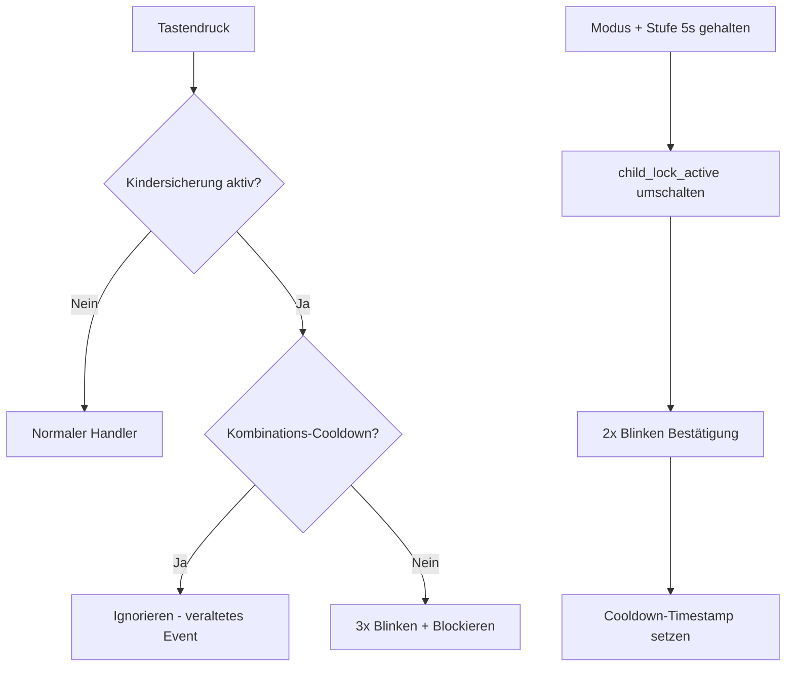

# 🔒 Kindersicherung — Implementierungsübersicht

## Übersicht

Die Kindersicherung sperrt die physischen Tasten des Bedienfelds am Lüftungsgerät, sodass das Gerät nicht versehentlich durch Drücken der Tasten verstellt werden kann. Die Steuerung über Home Assistant und das Web-Dashboard bleibt dabei uneingeschränkt funktionsfähig.

## Änderungen

| Datei | Änderung |
|:--|:--|
| [ventosync_base.yaml](../../packages/base/ventosync_base.yaml) | Persistente Globale `child_lock_active` hinzugefügt (bool, NVS-gespeichert) |
| [globals.h](../../components/helpers/globals.h) | `extern`-Deklarationen für `child_lock_active` und `child_lock_switch` hinzugefügt |
| [globals.h](../../components/helpers/globals.h) | `child_lock_combo_triggered_ms` Timestamp für Tastenkombinations-Cooldown hinzugefügt |
| [globals.h](../../components/helpers/globals.h) | Forward-Deklaration für `flash_all_leds()` hinzugefügt |
| [led_feedback.h](../../components/helpers/led_feedback.h) | `flash_all_leds(int count)` implementiert — lässt alle 9 LEDs N-mal blinken |
| [user_input.h](../../components/helpers/user_input.h) | Kindersicherungs-Prüfung in alle 5 physischen Button-Handler integriert |
| [ui_controls.yaml](../../packages/ui/ui_controls.yaml) | `switch.kindersicherung` (HA Konfigurationsentität) hinzugefügt |
| [logic_buttons.yaml](../../packages/io/logic_buttons.yaml) | Kombinationserkennung (Modus + Stufe 5s) und Script `child_lock_combo_handler` implementiert |

## Funktionsweise

### Steuerung über Home Assistant
- **Entität**: `switch.kindersicherung` (sichtbar im Bereich *Konfiguration* des Geräts)
- Schalter AN → alle physischen Tasten sind gesperrt
- Schalter AUS → normale Tastenbedienung wiederhergestellt
- HA-Bedienelemente (Moduswechsel, Intensitätsschieber etc.) werden **niemals gesperrt**

### Bedienung am physischen Gerät
- **Aktivieren/Deaktivieren**: Tasten **Modus** + **Stufe** gleichzeitig für **5 Sekunden** gedrückt halten
- **Bestätigung**: Alle LEDs blinken **2-mal** bei Statusänderung
- **Feedback bei gesperrter Taste**: Alle LEDs blinken **3-mal**, wenn eine gesperrte Taste gedrückt wird

### Technische Details

> [!NOTE]
> Der Status der Kindersicherung wird im Flash (NVS via `restore_value: true`) gespeichert und bleibt somit auch nach einem Neustart oder Stromausfall erhalten. Der 500ms-Cooldown verhindert, dass nach dem Loslassen der Tastenkombination ein unbeabsichtigtes Einzeltasten-Event ausgelöst wird.
