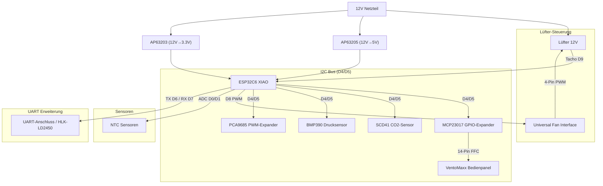

# 🛠️ Hardware, Stückliste (BOM) & Verdrahtung

Dieses Dokument bietet detaillierte Spezifikationen der zentralen Hardware-Komponenten, Aktoren, Umgebungssensoren, der Bedienpanel-Anbindung, der GPIO-Pinbelegung sowie der schematischen Schaltungsarchitektur von VentoSync.

---

## 🛠️ Hardware & Bill of Materials (BOM)

### Zentrale Einheit

| Komponente | Beschreibung |
| :--- | :--- |
| **MCU** | [Seeed Studio XIAO ESP32C6](https://wiki.seeedstudio.com/xiao_esp32c6_getting_started/) (RISC-V, WiFi 6, Zigbee/Matter ready) |
| **Power** | TRACO POWER TMPS 10-112 (230V AC zu 12V DC, 10W)  – **Premium-Wahl:** Zertifiziert nach **EN 60335-1** (Haushaltsgeräte) und **EN 62368-1** (IT/Industrie). Die Wahl fiel auf dieses High-End-Modul von Traco Power (Schweiz), da es durch seine doppelte Isolierung (**Schutzklasse II**) und hohe Isolationsspannung (4kV) maximale Sicherheit bietet. Im Gegensatz zu günstigen Netzteilen erfüllt es die strengen EMV-Anforderungen der **Klasse B** ohne externe Filter und ist für den wartungsfreien Dauerbetrieb (>10 Jahre) in Wohnräumen ausgelegt. |
| **DC/DC** | Diodes Inc. AP63205 (12V->5V) & AP63203 (12V->3.3V)  – **Eigenentwicklung:** Diese zwei professionellen Abwärtswandler (Buck Converter) wurden für eine hocheffiziente Energiewandlung (bis zu 94% Effizienz) direkt auf dem PCB implementiert. Sie gewährleisten eine extrem stabile Spannungsversorgung für MCU und Sensorik bei minimaler Wärmeentwicklung – ein wesentlicher Faktor für die Langzeitstabilität des Systems im Dauerbetrieb. |

### Aktoren & Sensoren

| Komponente | Beschreibung | Dokumentation |
| :--- | :--- | :--- |
| **Lüfter** | Original Ventomaxx V-WRG (EBM-PAPST 4412 F/2 GLL) 3-Pin PWM oder AxiRev (4-Pin PWM) | [Fan Component](https://esphome.io/components/fan/speed.html) |
| **SCD41** | Sensirion CO2-Sensor (Echtes CO2 400-5000ppm, Temp, Hum) via I²C | [SCD4X Component](https://esphome.io/components/sensor/scd4x.html) |
| **BMP390** | Bosch Hochpräziser Barometrischer Drucksensor via I²C | [BMP3XX Component](https://esphome.io/components/sensor/bmp3xx.html) |
| **BME680** | Bosch Gas Sensor (Fallback für IAQ/Luftqualität) via I²C | [BME680 Component](https://esphome.io/components/sensor/bme680.html) |
| **NTCs** | 2x NTC 10k (Zuluft/Abluft) für Effizienzmessung | [NTC Sensor](https://esphome.io/components/sensor/ntc.html) |
| **I/O Expander** | **MCP23017** (I2C) für VentoMaxx Panel | [MCP23017](https://esphome.io/components/mcp23017.html) |
| **LED Driver** | **PCA9685** (I2C) für dimmbare LEDs im VentoMaxx Panel | [PCA9685](https://esphome.io/components/output/pca9685.html) |

*Lüfter-Anschlussbelegung mit Originalkabel.*

Die vollständige Stückliste (Bill of Materials) befindet sich im Unterordner [../../EasyEDA-Pro](../../EasyEDA-Pro) in der [BOM](../../EasyEDA-Pro/BOM_VentoSync_PWM_PCB_VentoSync-WRG_ESP32_PWM_2026-03-01.csv) .

### 🖱️ Bedienpanel am Gerät

| Komponente | Beschreibung | Dokumentation |
| :--- | :--- | :--- |
| **VentoMaxx Panel** | Original Panel (14-Pin FFC). 3 Taster, 9 LEDs (via PCA9685 dimmbar). | Die PIN-Belegung des Original-Panels wurde von mir vollständig durchgemessen und dokumentiert, um die exakte Ansteuerung über das eigene PCB und die Port-Expander (MCP23017/PCA9685) zu ermöglichen. |

---

## 🔌 Pinbelegung & Verkabelung

Das System basiert auf dem [Seeed XIAO ESP32C6](https://wiki.seeedstudio.com/xiao_esp32c6_getting_started/).

⚠️ **WICHTIG:** Der Lüfter läuft mit 12V, die Logik mit 3.3V oder auch 5V (radar sensor). Entsprechende Spannungsteiler und Schutzbeschaltungen sind vorhanden.

| XIAO Pin | GPIO | Funktion | Bemerkung |
| :--- | :--- | :--- | :--- |
| **D0** | GPIO0 | [ADC Input](https://esphome.io/components/sensor/adc.html) | NTC Außen (Abluft) |
| **D1** | GPIO1 | [ADC Input](https://esphome.io/components/sensor/adc.html) | NTC Innen (Zuluft) |
| **D2** | GPIO2 | Output | **MCP23017 Reset** |
| **D3** | GPIO21 | Output | **PCA9685 OE** (Output Enable) |
| **D4** | GPIO22 | [I2C SDA](https://esphome.io/components/i2c.html) | SCD41, BMP390, PCA9685, MCP23017 |
| **D5** | GPIO23 | [I2C SCL](https://esphome.io/components/i2c.html) | SCD41, BMP390, PCA9685, MCP23017 |
| **D6** | GPIO16 | [UART RX](https://esphome.io/components/uart.html) | **HLK-LD2450 Radar RX** |
| **D7** | GPIO17 | [UART TX](https://esphome.io/components/uart.html) | **HLK-LD2450 Radar TX** |
| **D8** | GPIO19 | [PWM Output](https://esphome.io/components/output/ledc.html) | **Fan PWM Primary** |
| **D9** | GPIO20 | [Pulse Counter](https://esphome.io/components/sensor/pulse_counter.html) | **Fan Tacho** (Pullup via 3V3) |
| **D10** | GPIO18 | - | Unbelegt (NC) |

### 📊 Schematische Darstellung (Konzept)

