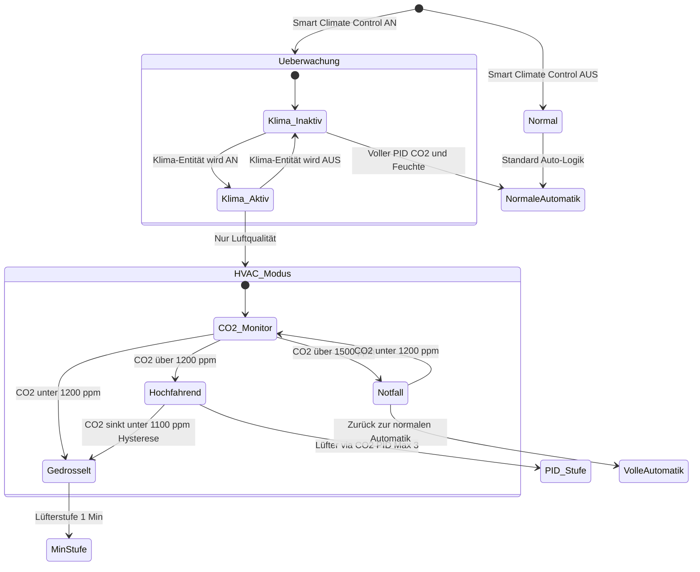

# ❄️🔥 Intelligente Klimaanlagen-Koordination (Smart Climate Control)

## Problemstellung

Dezentrale Wohnraumlüftungen mit Wärmerückgewinnung tauschen ständig Innen- gegen Außenluft aus. Wenn eine **Raumklimaanlage (Split-Klimagerät, mobiles Klimagerät oder Wärmepumpe)** aktiv einen Raum kühlt, ist intensive Lüftung kontraproduktiv: Sie zieht heiße, feuchte Außenluft herein, was den Klimakompressor stärker belastet und erheblich Energie verschwendet. Andererseits verschlechtert das vollständige Abschalten der Lüftung die Raumluftqualität (CO2-Anstieg, VOC-Anreicherung).

**Ziel:** Wenn die Klimaanlage in einem Raum aktiv ist, soll VentoSync die Lüftung automatisch auf das **Minimum drosseln, das für gesunde Raumluft erforderlich ist** — und nicht mehr.

---

## Funktionskonzept

### Aktivierung & Modusumschaltung

VentoSync bietet eine **dedizierte Boolean-Entität** in Home Assistant an, mit der das Smart Climate Control Feature pro Gerät aktiviert oder deaktiviert werden kann:

| HA-Entität | YAML-ID | Typ | Standard | Zweck |
| :--- | :--- | :---: | :---: | :--- |
| `Smart Climate Control` | `smart_climate_control` | **Switch** | Aus | Master-Schalter zur Aktivierung/Deaktivierung der HVAC-Koordination für dieses Gerät. |

Bei **deaktiviertem** Schalter ignoriert das Lüftungssystem den Klima-Status vollständig und arbeitet normal weiter.
Bei **aktiviertem** Schalter reagiert VentoSync auf die Klimaanlagen-Entität des Raums und passt sein Verhalten entsprechend an.

### Klimaanlagen-Status (aus Home Assistant)

Der Betriebszustand der Klimaanlage wird VentoSync über einen **Home Assistant Binary Sensor** (oder den Status einer `climate`-Entität) mitgeteilt. Die Konfiguration erfolgt pro Raum in Home Assistant:

| HA-Entität (Eingang) | Typ | Zweck |
| :--- | :---: | :--- |
| `input_boolean.ac_active_<raum>` oder `climate.<klimageraet>` | Binary / Climate | Zeigt an, ob die Klimaanlage in diesem Raum gerade aktiv kühlt (oder heizt). |

VentoSync liest diese Entität über den bestehenden HA-Sensor-Import-Mechanismus ein (analog zu `sensor.outdoor_humidity`). Die Zuordnung:

- **Klima aktiv** = `on` / Climate-Status ∈ {`cooling`, `heating`, `heat_cool`, `dry`}
- **Klima inaktiv** = `off` / Climate-Status ∈ {`off`, `fan_only`, `idle`}

---

## Regelungsstrategie: Nur-Luftqualitäts-Modus

Wenn Smart Climate Control **aktiviert** ist und die Klimaanlage **aktiv** läuft, wechselt die Lüftungslogik in ein eingeschränktes **„Nur Luftqualität"**-Regelprofil:

### Leitprinzip

> **Nur so viel lüften wie für die Gesundheit nötig — nicht für Komfort oder Entfeuchtung.**

Die standardmäßige Dual-PID-Regelung (CO2 + Feuchte) wird durch eine **reine CO2-Regelschleife** mit verschärften Grenzen ersetzt:

| Parameter | Normaler Automatik-Modus | HVAC-Koordinationsmodus | Begründung |
| :--- | :---: | :---: | :--- |
| **CO2-Zielwert (PID-Sollwert)** | `auto_co2_threshold` (Standard: 1000 ppm) | **1200 ppm** (konfigurierbar) | Gelockerte Zielgröße; 1200 ppm sind laut DIN EN 13779 Kategorie IDA 3 noch „akzeptabel" und ermöglichen deutlich weniger Luftaustausch. |
| **Max. Lüfterstufe** | `automatik_max_fan_level` (Standard: 7) | **3** (konfigurierbar, `hvac_max_fan_level`) | Harte Obergrenze zur Vermeidung von Energieverschwendung; Stufe 3 erzeugt minimale Geräusche und thermische Last. |
| **Min. Lüfterstufe** | `automatik_min_fan_level` (Standard: 2) | **1** | Absolutes Minimum für den Feuchteschutz (Grundlüftung nach DIN 1946-6). |
| **Feuchte-PID** | Aktiv (Entfeuchtung) | **Deaktiviert** | Die Klimaanlage übernimmt die Entfeuchtung wesentlich effizienter (Kondensation am Verdampfer). Lüftungsbasierte Entfeuchtung würde feuchte Außenluft importieren. |
| **Sommerkühlung (Bypass)** | Aktiv (Querlüftung) | **Deaktiviert** | Querlüftung und Bypass-Modus sind kontraproduktiv — sie ziehen heiße Luft herein, die die Klimaanlage dann erneut kühlen muss. |
| **Betriebsmodus-Override** | Dynamisch (ECO / VENTILATION) | **Erzwungen: ECO_RECOVERY** | Immer im Wärmerückgewinnungsmodus betreiben, um den thermischen Austausch mit der Außenluft zu minimieren. |

### CO2-Schwellenwert-Begründung

| CO2-Wert (ppm) | DIN EN 13779 Kategorie | Gesundheitsbewertung | Empfehlung |
| :---: | :---: | :--- | :--- |
| ≤ 800 | IDA 1 (Hoch) | Ausgezeichnet | Normales Ziel — bei aktivem Klimabetrieb unnötig |
| ≤ 1000 | IDA 2 (Mittel) | Gut — Pettenkofer-Grenzwert | Standard-Automatik-Zielwert |
| ≤ 1200 | IDA 3 (Mäßig) | Akzeptabel für kurzzeitigen Aufenthalt | **Empfohlener HVAC-Zielwert** — noch gesund, erhebliche Energieeinsparung |
| ≤ 1500 | IDA 4 (Niedrig) | Tolerierbar, nicht für Dauerbetrieb empfohlen | Absolute obere Sicherheitsgrenze |
| > 1500 | — | Schlecht | Notfall-Override — Rückkehr zur normalen Lüftung unabhängig vom Klima-Status |

> [!IMPORTANT]
> **Notfall-Override:** Wenn der CO2-Wert **1500 ppm** im HVAC-Koordinationsmodus überschreitet, hebt das System die Lüfterstufen-Begrenzung **vorübergehend auf** und kehrt zum normalen Automatik-Modus zurück, bis der CO2-Wert unter 1200 ppm sinkt. Gesundheit hat immer Vorrang vor Energieeffizienz.

---

## Entscheidungs-Zustandsautomat

---

## Konfigurations-Entitäten (Zukünftige HA-Integration)

| HA-Entität | YAML-ID | Typ | Standard | Zweck |
| :--- | :--- | :---: | :---: | :--- |
| `Smart Climate Control` | `smart_climate_control` | Switch | Aus | Aktivierung/Deaktivierung der HVAC-Koordination für dieses Gerät. |
| `HVAC: CO2-Schwellenwert` | `hvac_co2_threshold` | Number (Slider) | 1200 ppm | Gelockerte CO2-Zielgröße bei aktiver Klimaanlage. Bereich: 800–1500 ppm. |
| `HVAC: Max. Lüfterstufe` | `hvac_max_fan_level` | Number (Slider) | 3 | Maximale Lüfterstufe bei aktiver Klimaanlage. Bereich: 1–5. |
| `HVAC: Notfall-CO2-Override` | `hvac_emergency_co2` | Number (Slider) | 1500 ppm | CO2-Schwellenwert, ab dem der normale Automatik-Modus unabhängig vom Klima-Status greift. Bereich: 1200–2000 ppm. |
| `Klima Aktiv (Raum)` | `hvac_ac_active` | Binary Sensor (Import aus HA) | — | Spiegelt den Echtzeit-Status der Klimaanlage in diesem Raum wider. |

---

## Energie-Auswirkungsabschätzung

| Szenario | Ø Lüfterstufe | Geschätzte Leistung (Lüfter) | Thermische Last auf Klimaanlage |
| :--- | :---: | :---: | :--- |
| **Normale Automatik** (Klima ignoriert) | 4–6 | 2–4 W | Hoch — ständige Warmluftzufuhr, Klima kompensiert |
| **HVAC-Koordination** (Klima aktiv) | 1–3 | 0,5–1,5 W | **Minimal** — nahezu kein thermischer Austausch mit der Außenluft |
| **Aus** (keine Lüftung) | 0 | 0 W | Keine — aber CO2 steigt, ungesund |

> [!TIP]
> In einem typischen 20 m² Schlafzimmer mit 2 Personen und einer 3,5 kW Split-Klimaanlage kann die Drosselung der Lüftung von Stufe 5 auf Stufe 1–2 während des Klimabetriebs die thermische Kompensationslast der Klimaanlage um geschätzte **50–150 W** kontinuierlicher Kühlleistung reduzieren — das entspricht einer Einsparung von ca. **10–20 % des Energieverbrauchs der Klimaanlage** während der Spitzenzeiten im Sommer.

---

## Implementierungshinweise

1. **Sensor-Anforderungen:** Keine zusätzlichen Sensoren erforderlich. Das Feature nutzt den vorhandenen SCD43-CO2-Sensor und eine Home-Assistant-Entität für den Klima-Status.
2. **ESP-NOW-Propagierung:** Wenn das Master-Gerät in den HVAC-Koordinationsmodus wechselt, überträgt es die eingeschränkte Stufen-Obergrenze an alle Slave-Geräte in der Raumgruppe und stellt so eine synchronisierte Drosselung sicher.
3. **Modus-Persistenz:** Die HVAC-Koordination ist ein **Modifikator** des bestehenden Smart-Automatik-Modus, kein eigenständiger Betriebsmodus. Sie wirkt sich nur aus, wenn `smart_climate_control` AN ist **und** die Klima-Entität einen aktiven Zustand meldet. Der Lüftungsmodus-Selektor (`select.ventilation_mode`) bleibt unverändert.
4. **Übergangsverhalten:** Wenn die Klimaanlage abschaltet, fährt das System sanft in den normalen Automatik-Betrieb zurück — mit der Standard-Rampe von ±1 Stufe pro 10-Sekunden-Zyklus, um plötzliche Lüftergeräusche zu vermeiden.
5. **Heizbetrieb-Unterstützung:** Die gleiche Logik gilt, wenn die Klimaanlage im **Heizmodus** (Winter) arbeitet — intensive Lüftung würde warme Raumluft nach draußen abführen. Der HVAC-Koordinationsmodus ist agnostisch gegenüber Kühlen oder Heizen.
6. **Integrationspunkt:** Die Klima-Status-Entität wird einmalig pro Raum in der VentoSync-YAML-Konfiguration oder über einen zukünftigen Home-Assistant-Konfigurationsflow eingerichtet, analog zum bestehenden Import von `sensor.outdoor_humidity`.
