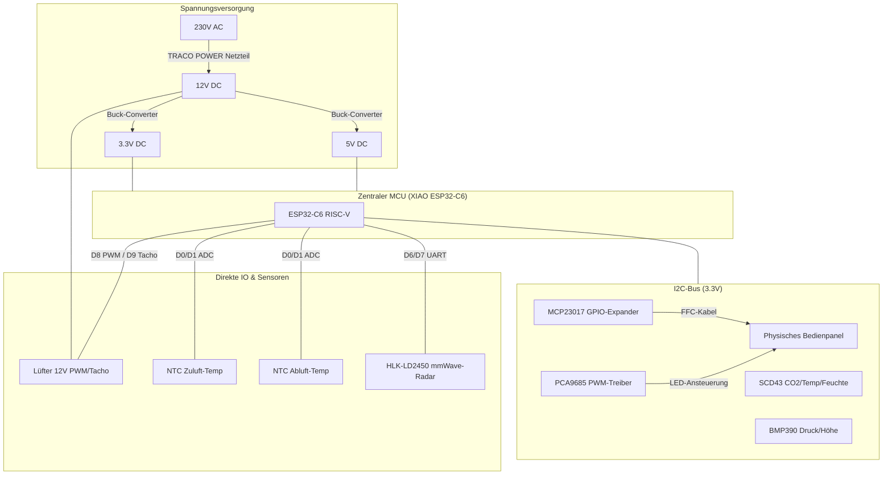
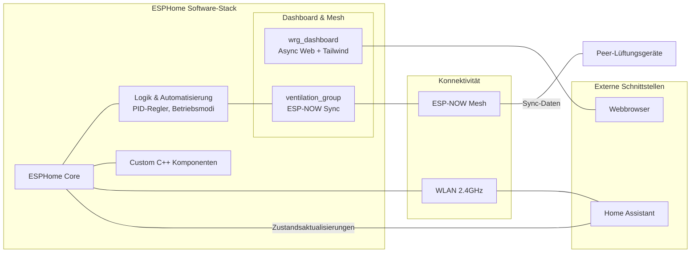

# 🏛️ Systemarchitektur – ESPHome Lüftungssteuerung

Dieses Dokument bietet einen Überblick über die Hardware- und Softwarearchitektur des smarten dezentralen Lüftungssystems VentoSync.

## Hardware-Architektur

Das System basiert auf dem **Seeed Studio XIAO ESP32-C6** mit 32-Bit RISC-V Kern und Multi-Protokoll-Konnektivität (Wi-Fi 6, Bluetooth 5, Zigbee/Thread, ESP-NOW).

## Software- & Konnektivitäts-Architektur

Das Projekt kombiniert den modularen Aufbau von ESPHome mit maßgeschneiderten C++ Komponenten für das Dashboard und die Mesh-Synchronisation.

## Funktionsübersicht

1. **Sensoren**: Erfassung von Umweltdaten über SCD43, BMP390, mmWave-Radar und NTCs.
2. **Logik**: Die Schicht `logic_automation` verarbeitet Sensordaten über PID-Regler zur Ermittlung der optimalen Lüfterdrehzahl.
3. **Mesh-Synchronisierung**: Die Komponente `ventilation_group` stellt über ESP-NOW sicher, dass alle Geräte in einem Raum/Stockwerk mit synchronisierten Phasen und Betriebsmodi arbeiten.
4. **Dashboard**: Die Komponente `wrg_dashboard` stellt eine performante Echtzeit-Weboberfläche (mit Tailwind CSS & Chart.js) unabhängig von Home Assistant bereit.
5. **Bedienung**: Benutzereingaben über das physische Panel (MCP23017), die Web-UI oder Home Assistant werden verarbeitet und im Gruppenverbund synchronisiert.
