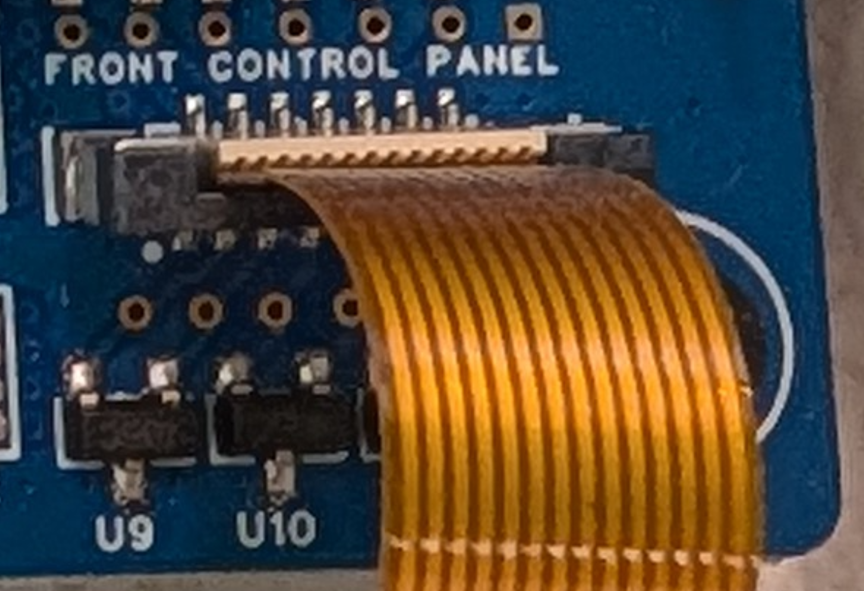
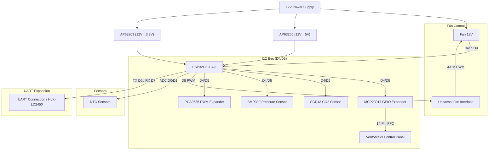

# 🛠️ Hardware, Bill of Materials (BOM) & Wiring

This document provides detailed specifications of the central hardware components, actuators, environmental sensors, control panel connection, pin assignments, and schematic architecture for VentoSync.

---

## 🛠️ Hardware & Bill of Materials (BOM)

### Central Unit

| Component | Description |
| :--- | :--- |
| **MCU** | [Seeed Studio XIAO ESP32C6](https://wiki.seeedstudio.com/xiao_esp32c6_getting_started/) (RISC-V, WiFi 6, Zigbee/Matter ready) |
| **Power** | TRACO POWER TMPS 10-112 (230VAC to 12VDC, 10W)  – **Premium Choice:** Certified according to **EN 60335-1** (household appliances) and **EN 62368-1** (IT/industry). The choice fell on this high-end module from Traco Power (Switzerland) because it offers maximum safety through its double insulation (**protection class II**) and high insulation voltage (4kV). Unlike inexpensive power supplies, it meets the strict EMC requirements of **Class B** without external filters and is designed for maintenance-free continuous operation (>10 years) in residential spaces. |
| **DC/DC** | Diodes Inc. AP63205 (12V->5V) & AP63203 (12V->3.3V)  – **Custom Development:** These two professional step-down converters (Buck Converters) were implemented directly on the PCB for high-efficiency energy conversion (up to 94% efficiency). They ensure an extremely stable power supply for MCU and sensors with minimal heat generation – a key factor for the long-term stability of the system in continuous operation. |

### Actuators & Sensors

| Component | Description | Documentation |
| :--- | :--- | :--- |
| **Fan** | The original VentoMaxx V-WRG units use the **EBM-PAPST 4412 F/2 GLL (VarioPro)** **3-Pin PWM** (without tachometer signal) fan. Alternatively, a much more modern and quieter **AxiRev** (4-Pin PWM) can be used. For this, however, you would have to handle the mounting via a 3D-printed adapter. *Wiring shown below.* | [Fan Component](https://esphome.io/components/fan/speed.html) |
| **SCD43** | Sensirion CO2 sensor (Real CO2 400-5000ppm, Temp, Hum) via I²C | [SCD4X Component](https://esphome.io/components/sensor/scd4x.html) |
| **BMP390** | Bosch high-precision barometric pressure sensor via I²C | [BMP3XX Component](https://esphome.io/components/sensor/bmp3xx.html) |
| **BME680** | Bosch gas sensor (fallback for IAQ/air quality) via I²C | [BME680 Component](https://esphome.io/components/sensor/bme680.html) |
| **NTCs** | 2x NTC 10k (Supply Air/Exhaust Air) for efficiency measurement | [NTC Sensor](https://esphome.io/components/sensor/NTC.html) |
| **I/O Expander** | **MCP23017** (I2C) for VentoMaxx panel | [MCP23017](https://esphome.io/components/mcp23017.html) |
| **LED Driver** | **PCA9685** (I2C) for dimmable LEDs in VentoMaxx panel | [PCA9685](https://esphome.io/components/output/pca9685.html) |

*Fan connector wiring, with original cable.*

The complete Bill of Materials (BOM) is located in the [EasyEDA-Pro](../../EasyEDA-Pro/) subfolder in the [BOM](../../EasyEDA-Pro/BOM_VentoSync_PWM_PCB_VentoSync-WRG_ESP32_PWM_2026-03-01.csv).

### 🖱️ On-Device Control Panel

| Component | Description | Documentation |
| :--- | :--- | :--- |
| **VentoMaxx Panel** | Original panel (14-Pin FFC). 3 buttons, 9 LEDs (dimmable via PCA9685). | The pinout of the original panel was completely measured and documented by me to enable exact control via the custom PCB and the port expanders (MCP23017/PCA9685). |

---

## 🔌 Pin Assignment & Wiring

The system is based on the [Seeed XIAO ESP32C6](https://wiki.seeedstudio.com/xiao_esp32c6_getting_started/).

⚠️ **IMPORTANT:** The fan runs on 12V, the logic on 3.3V or 5V (radar sensor). Corresponding voltage dividers and protection circuits are present.

| XIAO Pin | GPIO | Function | Remark |
| :--- | :--- | :--- | :--- |
| **D0** | GPIO0 | [ADC Input](https://esphome.io/components/sensor/adc.html) | NTC Outside (Exhaust Air) |
| **D1** | GPIO1 | [ADC Input](https://esphome.io/components/sensor/adc.html) | NTC Inside (Supply Air) |
| **D2** | GPIO2 | Output | **MCP23017 Reset** |
| **D3** | GPIO21 | Output | **PCA9685 OE** (Output Enable) |
| **D4** | GPIO22 | [I2C SDA](https://esphome.io/components/i2c.html) | SCD43, BMP390, PCA9685, MCP23017 |
| **D5** | GPIO23 | [I2C SCL](https://esphome.io/components/i2c.html) | SCD43, BMP390, PCA9685, MCP23017 |
| **D6** | GPIO16 | [UART RX](https://esphome.io/components/uart.html) | **HLK-LD2450 Radar RX** |
| **D7** | GPIO17 | [UART TX](https://esphome.io/components/uart.html) | **HLK-LD2450 Radar TX** |
| **D8** | GPIO19 | [PWM Output](https://esphome.io/components/output/ledc.html) | **Fan PWM Primary** |
| **D9** | GPIO20 | [Pulse Counter](https://esphome.io/components/sensor/pulse_counter.html) | **Fan Tach** (Pullup via 3V3) |
| **D10** | GPIO18 | - | Not connected (NC) |

### 📊 Schematic Representation (Concept)

