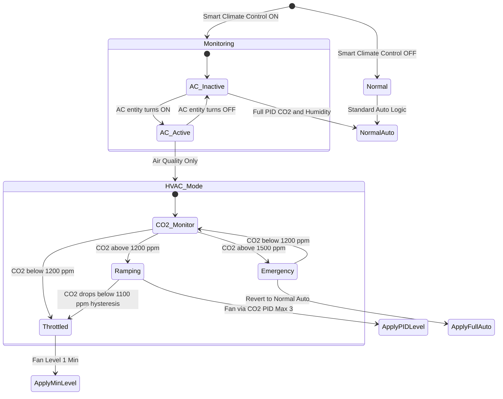

# ❄️🔥 Smart Climate Control — HVAC Coordination

## Problem Statement

Decentralized heat-recovery ventilation units exchange indoor air with outdoor air. When a **room air conditioner (split AC, portable AC, or heat pump)** is actively cooling a room, high-intensity ventilation is counter-productive: it draws in hot, humid outdoor air, forcing the AC compressor to work harder and wasting significant energy. Conversely, shutting ventilation off entirely degrades indoor air quality (CO2 buildup, VOC accumulation).

**Goal:** When the AC in a given room is active, VentoSync shall automatically throttle ventilation to the **minimum level required to maintain healthy indoor air quality** — and no more.

---

## Functional Concept

### Activation & Mode Toggle

VentoSync exposes a **dedicated boolean entity** in Home Assistant that enables or disables the Smart Climate Control feature per device:

| HA Entity | YAML ID | Type | Default | Purpose |
| :--- | :--- | :---: | :---: | :--- |
| `Smart Climate Control` | `smart_climate_control` | **Switch** | Off | Master enable/disable for HVAC coordination on this device. |

When **disabled**, the ventilation system ignores the AC state entirely and operates normally.
When **enabled**, VentoSync listens to the room's AC state entity and adjusts its behavior accordingly.

### AC State Input (from Home Assistant)

The AC's operational state is communicated to VentoSync via a **Home Assistant binary sensor** (or `climate` entity state). The user configures this per-room in Home Assistant:

| HA Entity (Input) | Type | Purpose |
| :--- | :---: | :--- |
| `input_boolean.ac_active_<room>` or `climate.<ac_device>` | Binary / Climate | Indicates whether the AC unit in this room is currently in an active cooling (or heating) state. |

VentoSync reads this entity via the existing HA sensor import mechanism (similar to `sensor.outdoor_humidity`). The mapping is:

- **AC Active** = `on` / climate state ∈ {`cooling`, `heating`, `heat_cool`, `dry`}
- **AC Inactive** = `off` / climate state ∈ {`off`, `fan_only`, `idle`}

---

## Control Strategy: Air-Quality-Only Mode

When Smart Climate Control is **enabled** and the AC is **active**, the ventilation logic switches to a restricted **"Air Quality Only"** regulation profile:

### Governing Principle

> **Ventilate only as much as necessary for health, not for comfort or dehumidification.**

The standard dual-PID (CO2 + Humidity) logic is replaced by a **CO2-only** control loop with tightened constraints:

| Parameter | Normal Automatic Mode | HVAC Coordination Mode | Rationale |
| :--- | :---: | :---: | :--- |
| **CO2 Target (PID Setpoint)** | `auto_co2_threshold` (default: 1000 ppm) | **1200 ppm** (configurable) | Relaxed target; 1200 ppm is still "acceptable" per DIN EN 13779 Category IDA 3 and allows significantly less air exchange. |
| **Max Fan Level** | `automatik_max_fan_level` (default: 7) | **3** (configurable, `hvac_max_fan_level`) | Hard cap to prevent energy waste; Level 3 produces minimal airflow noise and thermal load. |
| **Min Fan Level** | `automatik_min_fan_level` (default: 2) | **1** | Absolute minimum for moisture protection (DIN 1946-6 base ventilation). |
| **Humidity PID** | Active (dehumidification) | **Disabled** | The AC itself handles dehumidification far more efficiently (condensation on the evaporator coil). Ventilation-based dehumidification would import humid outdoor air. |
| **Summer Cooling (Bypass)** | Active (cross-ventilation) | **Disabled** | Cross-ventilation and bypass mode are counter-productive — they draw in hot air that the AC must then re-cool. |
| **Operating Mode Override** | Dynamic (ECO / VENTILATION) | **Forced: ECO_RECOVERY** | Always operate in heat-recovery mode to minimize thermal exchange with outdoors. |

### CO2 Threshold Justification

| CO2 Level (ppm) | DIN EN 13779 Category | Health Assessment | Recommendation |
| :---: | :---: | :--- | :--- |
| ≤ 800 | IDA 1 (High) | Excellent | Normal target — unnecessary during AC operation |
| ≤ 1000 | IDA 2 (Medium) | Good — Pettenkofer limit | Standard automatic target |
| ≤ 1200 | IDA 3 (Moderate) | Acceptable for short-term occupancy | **Recommended HVAC target** — still healthy, significant energy savings |
| ≤ 1500 | IDA 4 (Low) | Tolerable, not recommended long-term | Absolute upper safety boundary |
| > 1500 | — | Poor | Emergency override — revert to normal ventilation regardless of AC state |

> [!IMPORTANT]
> **Emergency Override:** If CO2 exceeds **1500 ppm** while in HVAC Coordination mode, the system shall **temporarily override** the fan level cap and revert to normal automatic mode until CO2 drops below 1200 ppm. Health always takes priority over energy efficiency.

---

## Decision State Machine

---

## Configuration Entities (Future HA Integration)

| HA Entity | YAML ID | Type | Default | Purpose |
| :--- | :--- | :---: | :---: | :--- |
| `Smart Climate Control` | `smart_climate_control` | Switch | Off | Enable/disable HVAC coordination for this device. |
| `HVAC: CO2 Threshold` | `hvac_co2_threshold` | Number (Slider) | 1200 ppm | Relaxed CO2 target while AC is active. Range: 800–1500 ppm. |
| `HVAC: Max Fan Level` | `hvac_max_fan_level` | Number (Slider) | 3 | Maximum fan level while AC is active. Range: 1–5. |
| `HVAC: Emergency CO2 Override` | `hvac_emergency_co2` | Number (Slider) | 1500 ppm | CO2 threshold at which normal auto mode resumes regardless of AC state. Range: 1200–2000 ppm. |
| `AC Active (Room)` | `hvac_ac_active` | Binary Sensor (imported from HA) | — | Reflects the real-time state of the AC unit in this room. |

---

## Energy Impact Estimation

| Scenario | Avg. Fan Level | Est. Power (Fan) | Thermal Load on AC |
| :--- | :---: | :---: | :--- |
| **Normal Auto** (AC ignored) | 4–6 | 2–4 W | High — constant warm air intake, AC compensates |
| **HVAC Coordination** (AC active) | 1–3 | 0.5–1.5 W | **Minimal** — nearly no thermal exchange with outdoors |
| **Off** (no ventilation) | 0 | 0 W | None — but CO2 rises, unhealthy |

> [!TIP]
> In a typical 20 m² bedroom with 2 occupants and a 3.5 kW split AC, throttling ventilation from Level 5 to Level 1–2 during AC operation can reduce the AC's thermal compensation load by an estimated **50–150 W** of continuous cooling demand — saving approximately **10–20% of AC energy consumption** during peak summer hours.

---

## Implementation Notes

1. **Sensor Requirements:** No additional sensors required. The feature relies on the existing SCD43 CO2 sensor and a Home Assistant entity for AC state.
2. **ESP-NOW Propagation:** When the Master device enters HVAC Coordination mode, it broadcasts the restricted level cap to all Slave devices in the room group, ensuring synchronized throttling.
3. **Mode Persistence:** HVAC Coordination is a **modifier** on the existing Smart Automatic mode, not a separate operating mode. It only affects behavior while `smart_climate_control` is ON **and** the AC entity reports active. The ventilation mode selector (`select.ventilation_mode`) remains unchanged.
4. **Transition Behavior:** When the AC turns off, the system smoothly ramps back to normal automatic operation using the standard ±1 level per 10-second soft ramp, avoiding sudden fan speed jumps.
5. **Heating Mode Support:** The same logic applies when the AC operates in **heating mode** during winter — high ventilation would exhaust warm indoor air. The HVAC Coordination mode is agnostic to whether the AC is cooling or heating.
6. **Integration Point:** The AC state entity is configured once per room in the VentoSync YAML or via a future Home Assistant configuration flow, analogous to how `sensor.outdoor_humidity` is currently imported.
