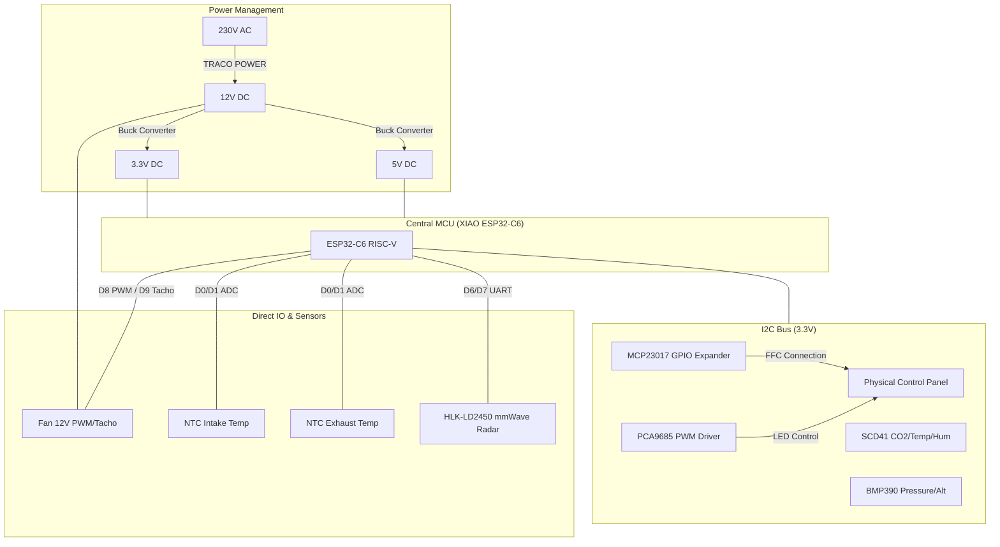
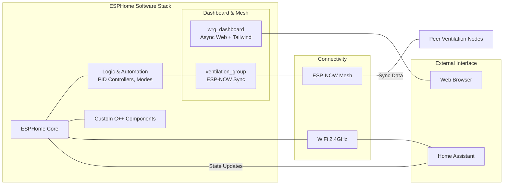

# System Architecture - ESPHome Ventilation Control

This document provides a high-level overview of the hardware and software architecture of the smart ventilation system.

## Hardware Architecture

The system is centered around the **Seeed Studio XIAO ESP32-C6**, utilizing its RISC-V core and multi-protocol connectivity.

## Software & Connectivity Architecture

The project leverages the modularity of ESPHome combined with custom C++ components for the dashboard and mesh synchronization.

## Functional Overview

1.  **Sensors**: Data is collected from SCD41, BMP390, Radar, and NTCs.
2.  **Logic**: The `logic_automation` layer processes sensor data using PID controllers to determine the optimal fan speed.
3.  **Mesh Sync**: The `ventilation_group` component via ESP-NOW ensures all nodes in a room/floor operate with synchronized phases and modes.
4.  **Dashboard**: The `wrg_dashboard` provides a real-time, high-performance UI (using Tailwind CSS) independent of Home Assistant.
5.  **Control**: User input from the physical panel (via MCP23017), Web UI, or Home Assistant is processed and synchronized across the group.
